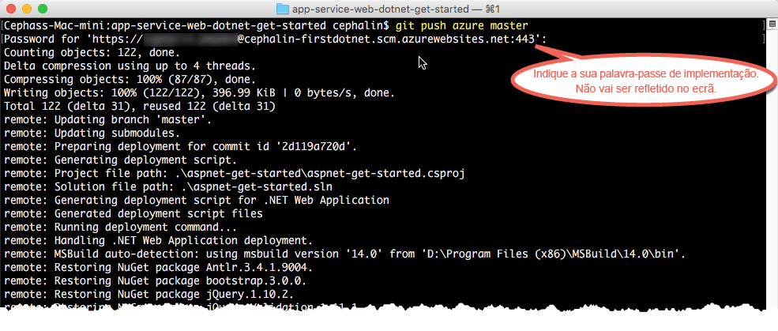

# Implementar a primeira aplicação Web .NET no Azure em cinco minutos
Este tutorial ajuda-o a implementar uma aplicação Web .NET simples no [Serviço de Aplicações do Azure](../app-service/app-service-value-prop-what-is.md).
Pode utilizar o Serviço de Aplicações para criar aplicações, [back-ends de aplicações móveis](/documentation/learning-paths/appservice-mobileapps/) e [aplicações API](../app-service-api/app-service-api-apps-why-best-platform.md).

Irá: 

* Criar uma aplicação Web no Serviço de Aplicações do Azure.
* Implementar código ASP.NET de exemplo.
* Ver o seu código em execução em direto na produção.
* Atualizar a sua aplicação Web da mesma forma que [emitiria consolidações do Git](https://git-scm.com/docs/git-push).

## Pré-requisitos
* [Git](http://www.git-scm.com/downloads).
* [CLI do Azure](../xplat-cli-install.md).
* Uma conta do Microsoft Azure. Se não tiver uma conta, pode [inscrever-se numa avaliação gratuita](https://azure.microsoft.com/pricing/free-trial/?WT.mc_id=A261C142F) ou [ativar os benefícios de subscritor do Visual Studio](https://azure.microsoft.com/pricing/member-offers/msdn-benefits-details/?WT.mc_id=A261C142F).

> [!NOTE]
> Pode [Experimentar o Serviço de Aplicações](http://go.microsoft.com/fwlink/?LinkId=523751) sem uma conta do Azure. Crie uma aplicação de introdução e experimente-a durante uma hora, sem cartão de crédito nem compromissos.
> 
> 

## Implementar uma aplicação Web em .NET
1. Abra uma nova linha de comandos do Windows, uma janela do PowerShell, uma shell do Linux ou um terminal do OS X. Execute `git --version` e `azure --version` para verificar se o Git e a CLI do Azure estão instalados no sua máquina.
   
    
   
    Se não tiver instalado as ferramentas, consulte [Pré-requisitos](#Prerequisites) para obter as ligações para as transferências.
2. Inicie sessão no Azure desta forma:
   
        azure login
   
    Siga a mensagem de ajuda para continuar o processo de início de sessão.
   
    
3. Altere a CLI do Azure para o modo ASM e defina o utilizador da implementação do Serviço de Aplicações. Irá implementar código com as credenciais mais tarde.
   
        azure config mode asm
        azure site deployment user set --username <username> --pass <password>
4. Mude para um diretório de trabalho (`CD`) e clone a aplicação de exemplo.
   
        git clone https://github.com/Azure-Samples/app-service-web-dotnet-get-started.git
5. Altere para o repositório da sua aplicação de exemplo. 
   
        cd app-service-web-dotnet-get-started
6. Crie o recurso de aplicação Serviço de Aplicações no Azure com um nome de aplicação exclusivo e o utilizador de implementação configurado anteriormente. Quando lhe for pedido, especifique o número da região pretendida.
   
        azure site create <app_name> --git --gitusername <username>
   
    
   
    Agora, a sua aplicação está criada no Azure. Além disso, o seu diretório atual é inicializado pelo Git e ligado à nova aplicação do App Service como um Git remoto.
    Pode navegar para o URL da aplicação (http://&lt;app_name>.azurewebsites.net) e ver a fantástica página HTML predefinida, mas o mais importante agora é introduzir o seu código.
7. Implemente o código de exemplo na sua aplicação do Azure, tal como emitiria qualquer código com o Git. Quando lhe for pedido, utilize a palavra-passe que configurou anteriormente.
   
        git push azure master
   
    
   
    `git push`não só coloca o código no Azure, como também restaura os pacotes necessários e cria os binários do ASP.NET. 

Parabéns! Implementou a sua aplicação no App Service do Azure.

## Ver a sua aplicação em execução
Para ver a sua aplicação em execução no Azure, execute este comando a partir de qualquer diretório no seu repositório:

    azure site browse

## Efetuar atualizações à sua aplicação
Agora, pode utilizar o Git para emitir a partir da raiz do projeto (repositório) em qualquer altura para efetuar uma atualização ao site online. Pode fazê-lo tal como quando implementou o seu código pela primeira vez. Por exemplo, sempre que pretender emitir uma nova alteração que tenha testado localmente, basta executar os seguintes comandos a partir da raiz do projeto (repositório):

    git add .
    git commit -m "<your_message>"
    git push azure master

## Passos seguintes
Saiba como criar, programar e implementar aplicações Web .NET no Azure diretamente no Visual Studio em [Implementar uma aplicação Web ASP.NET no Serviço de Aplicações do Azure através do Visual Studio](web-sites-dotnet-get-started.md).

Em alternativa, faça mais com a sua primeira aplicação Web. Por exemplo:

* Experimente [outras formas de implementar o seu código no Azure](web-sites-deploy.md). Por exemplo, para implementar a partir de um dos seus repositórios do GitHub, só tem de selecionar **GitHub** em vez de **Repositório de Git Local** nas **Opções de implementação**.
* Eleve a sua aplicação do Azure ao nível seguinte. Autentique os seus utilizadores. Dimensione-a com base no pedido. Configure alguns alertas de desempenho. Tudo com apenas alguns cliques. Consulte [Adicionar funcionalidades à sua primeira aplicação Web](app-service-web-get-started-2.md).

<!--HONumber=Dec16_HO1-->

