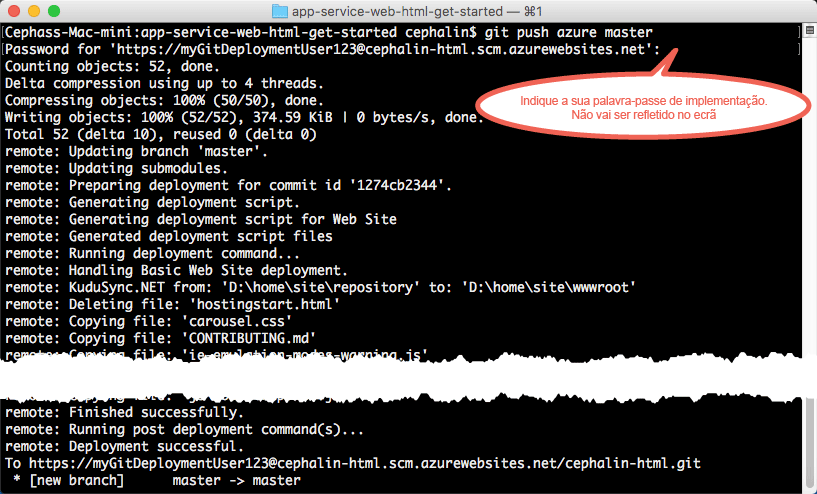

# Implementar a sua primeira aplicação Web HTML no Azure em cinco minutos

> [!div class="op_single_selector"]
> * [Primeiro site HTML](app-service-web-get-started-html-cli-nodejs.md)
> * [Primeira aplicação .NET](app-service-web-get-started-dotnet-cli-nodejs.md)
> * [Primeira aplicação PHP](app-service-web-get-started-php-cli-nodejs.md)
> * [Primeira aplicação Node.js](app-service-web-get-started-nodejs-cli-nodejs.md)
> * [Primeira aplicação Python](app-service-web-get-started-python-cli-nodejs.md)
> * [Primeira aplicação Java](app-service-web-get-started-java.md)
> 
> 

Este tutorial ajuda-o a implementar uma aplicação Web HTML+CSS simples no [Serviço de Aplicações do Azure](../app-service/app-service-value-prop-what-is.md).
Pode utilizar o Serviço de Aplicações para criar aplicações, [back-ends de aplicações móveis](/documentation/learning-paths/appservice-mobileapps/) e [aplicações API](../app-service-api/app-service-api-apps-why-best-platform.md).

Irá: 

* Criar uma aplicação Web no Serviço de Aplicações do Azure.
* Implementar HTML e CSS na aplicação.
* Ver as suas páginas em execução em direto na produção.
* Atualizar o seu conteúdo da mesma forma que [emitiria consolidações do Git](https://git-scm.com/docs/git-push).

[!INCLUDE [app-service-linux](../../includes/app-service-linux.md)]

## Versões CLI para concluir a tarefa

Pode concluir a tarefa utilizando uma das seguintes versões CLI:

- [Azure CLI 1.0](app-service-web-get-started-html-cli-nodejs.md) – CLI para os modelos de implementação de gestão clássica e de recursos
- [Azure CLI 2.0 (Pré-visualização)](app-service-web-get-started-html.md) - CLI de próxima geração para o modelo de implementação de gestão de recursos

## Pré-requisitos
* [Git](http://www.git-scm.com/downloads).
* [CLI do Azure](../xplat-cli-install.md).
* Uma conta do Microsoft Azure. Se não tiver uma conta, pode [inscrever-se numa avaliação gratuita](https://azure.microsoft.com/pricing/free-trial/?WT.mc_id=A261C142F) ou [ativar os benefícios de subscritor do Visual Studio](https://azure.microsoft.com/pricing/member-offers/msdn-benefits-details/?WT.mc_id=A261C142F).

> [!NOTE]
> Pode [Experimentar o Serviço de Aplicações](https://azure.microsoft.com/try/app-service/) sem uma conta do Azure. Crie uma aplicação de introdução e experimente-a durante uma hora, sem cartão de crédito nem compromissos.
> 
> 

## Implementar um site HTML simples
1. Abra uma nova linha de comandos do Windows, uma janela do PowerShell, uma shell do Linux ou um terminal do OS X. Execute `git --version` e `azure --version` para verificar se o Git e a CLI do Azure estão instalados no sua máquina.
   
    
   
    Se não tiver instalado as ferramentas, consulte [Pré-requisitos](#Prerequisites) para obter as ligações para as transferências.
2. Inicie sessão no Azure desta forma:
   
        azure login
   
    Siga a mensagem de ajuda para continuar o processo de início de sessão.
   
    

3. Altere a CLI do Azure para o modo ASM e defina o utilizador da implementação do Serviço de Aplicações. Irá implementar código com as credenciais mais tarde.
   
        azure config mode asm
        azure site deployment user set --username <username> --pass <password>

4. Mude para um diretório de trabalho (`CD`) e clone o site HTML de exemplo desta forma:
   
        git clone https://github.com/Azure-Samples/app-service-web-html-get-started.git

5. Altere para o repositório da sua aplicação de exemplo. 
   
        cd app-service-web-html-get-started

6. Crie o recurso de aplicação Serviço de Aplicações no Azure com um nome de aplicação exclusivo e o utilizador de implementação configurado anteriormente. Quando lhe for pedido, especifique o número da região pretendida.
   
        azure site create <app_name> --git --gitusername <username>
   
    
   
    Agora, a sua aplicação está criada no Azure. Além disso, o seu diretório atual é inicializado pelo Git e ligado à nova aplicação do App Service como um Git remoto.
    Pode navegar para o URL da aplicação (http://&lt;app_name>.azurewebsites.net) e ver a fantástica página HTML predefinida, mas o mais importante agora é introduzir o seu código.
7. Implemente o código de exemplo na sua aplicação do Azure, tal como emitiria qualquer código com o Git. Quando lhe for pedido, utilize a palavra-passe que configurou anteriormente.
   
        git push azure master
   
    
   
    Se utilizou uma das arquiteturas de linguagem, será apresentado um resultado diferente. Tal deve-se ao facto de que `git push` não só coloca código no Azure, como também aciona tarefas de implementação no motor de implementação. Se tiver algum ficheiro package.json (Node.js) ou requirements.txt (Python) na raiz (repositório) do projeto ou se tiver um ficheiro packages.config no seu projeto ASP.NET, o script de implementação restaura automaticamente os pacotes necessários. Também pode [ativar a extensão de Compositor](web-sites-php-mysql-deploy-use-git.md#composer) para processar automaticamente ficheiros composer.json na sua aplicação PHP.

Parabéns! Implementou a sua aplicação no App Service do Azure.

## Ver a sua aplicação em execução
Para ver a sua aplicação em execução no Azure, execute este comando a partir de qualquer diretório no seu repositório:

    azure site browse

## Efetuar atualizações à sua aplicação
Agora, pode utilizar o Git para emitir a partir da raiz do projeto (repositório) em qualquer altura para efetuar uma atualização ao site online. Pode fazê-lo tal como quando implementou o seu código pela primeira vez. Por exemplo, sempre que pretender emitir uma nova alteração que tenha testado localmente, basta executar os seguintes comandos a partir da raiz do projeto (repositório):

    git add .
    git commit -m "<your_message>"
    git push azure master

## Passos seguintes
Localize os passos de desenvolvimento e de implementação preferenciais para a arquitetura da sua linguagem:

* [.NET](web-sites-dotnet-get-started.md)
* [PHP](app-service-web-php-get-started-cli-nodejs.md)
* [Node.js](app-service-web-nodejs-get-started-cli-nodejs.md)
* [python](web-sites-python-ptvs-django-mysql.md)
* [Java](web-sites-java-get-started.md)

Em alternativa, faça mais com a sua primeira aplicação Web. Por exemplo:

* Experimente [outras formas de implementar o seu código no Azure](web-sites-deploy.md). Por exemplo, para implementar a partir de um dos seus repositórios do GitHub, só tem de selecionar **GitHub** em vez de **Repositório de Git Local** nas **Opções de implementação**.
* Eleve a sua aplicação do Azure ao nível seguinte. Autentique os seus utilizadores. Dimensione-a com base no pedido. Configure alguns alertas de desempenho. Tudo com apenas alguns cliques. Consulte [Adicionar funcionalidades à sua primeira aplicação Web](app-service-web-get-started-2.md).

<!--HONumber=Jan17_HO4-->

