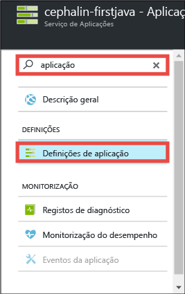
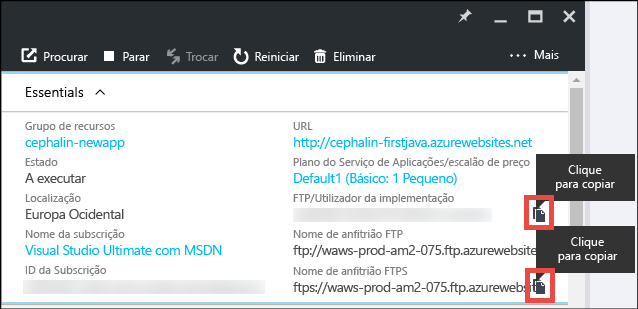
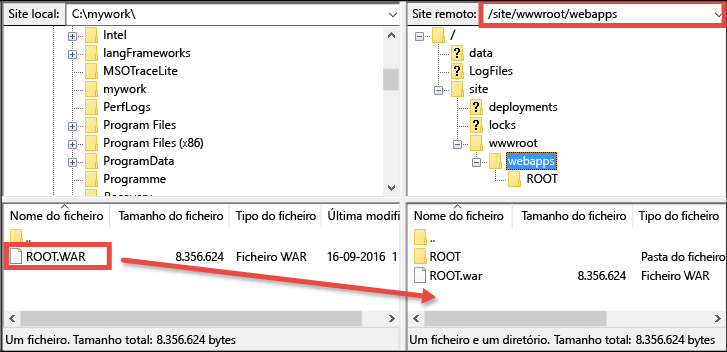

<properties 
    pageTitle="Implementar a sua primeira aplicação Web Java no Azure em cinco minutos | Microsoft Azure" 
    description="Saiba como é fácil executar aplicações Web no Serviço de Aplicações ao implementar uma aplicação de exemplo. Comece a programar verdadeiramente em pouco tempo e a ver resultados imediatos." 
    services="app-service\web"
    documentationCenter=""
    authors="cephalin"
    manager="wpickett"
    editor=""
/>

<tags
    ms.service="app-service-web"
    ms.workload="web"
    ms.tgt_pltfrm="na"
    ms.devlang="na"
    ms.topic="hero-article"
    ms.date="09/16/2016" 
    ms.author="cephalin"
/>
    
# Implementar a sua primeira aplicação Web Java no Azure em cinco minutos

Este tutorial ajuda-o a implementar uma aplicação Web Java simples no [Serviço de Aplicações do Azure](../app-service/app-service-value-prop-what-is.md).
Pode utilizar o Serviço de Aplicações para criar aplicações Web, [back-ends de aplicações móveis](/documentation/learning-paths/appservice-mobileapps/) e [aplicações API](../app-service-api/app-service-api-apps-why-best-platform.md).

Irá: 

- Criar uma aplicação Web no Serviço de Aplicações do Azure.
- Implementar uma aplicação Java de exemplo.
- Ver o seu código em execução em direto na produção.

## Pré-requisitos

- Obter um cliente FTP/FTPS, como o [FileZilla](https://filezilla-project.org/).
- Obter uma conta do Microsoft Azure. Se não tiver uma conta, pode [inscrever-se numa avaliação gratuita](/pricing/free-trial/?WT.mc_id=A261C142F) ou [ativar os benefícios de subscritor do Visual Studio](/pricing/member-offers/msdn-benefits-details/?WT.mc_id=A261C142F).

>[AZURE.NOTE] Pode [Experimentar o Serviço de Aplicações](http://go.microsoft.com/fwlink/?LinkId=523751) sem uma conta do Azure. Crie uma aplicação de introdução e experimente-a durante uma hora, sem cartão de crédito nem compromissos.

## Criar uma aplicação Web

1. Inicie sessão no [portal do Azure](https://portal.azure.com) com a sua conta do Azure.

2. No menu à esquerda, clique em **Novo** > **Web + Móvel** > **Aplicação Web**.

    

3. No painel de criação da aplicação, utilize as seguintes definições para a sua nova aplicação:

    - **Nome da aplicação**: escreva um nome exclusivo.
    - **Grupo de recursos**: selecione **Criar novo** e dê um nome ao grupo de recursos.
    - **Plano do Serviço de Aplicações/Localização**: clique nele para configurar e, em seguida, clique em **Criar Novo** para definir o nome, a localização e o escalão de preço do plano do Serviço de Aplicações. Pode utilizar o escalão de preço **Gratuito**.

    Quando tiver terminado, o painel de criação da aplicação deverá ter este aspeto:

    

3. Clique em **Criar** na parte inferior. Pode clicar no ícone de **Notificação** na parte superior para ver o progresso.

    

4. Quando a implementação estiver concluída, deverá ver esta mensagem de notificação. Clique na mensagem para abrir o painel da implementação.

    

5. No painel **Implementação concluída com êxito**, clique na ligação **Recurso** para abrir o painel da sua nova aplicação Web.

    

## Implementar uma aplicação Java para a sua aplicação Web

Agora, vamos implementar uma aplicação Java no Azure através de FTPS.

5. No painel da aplicação Web, desloque-se até às **Definições da aplicação** ou procure as mesmas e, em seguida, clique nestas. 

    

6. Em **Versão Java**, selecione **Java 8** e clique em **Guardar**.

    

    Quando receber a notificação **Definições da aplicação Web atualizadas com êxito**, navegue para http://*&lt;nomeaplic>*.azurewebsites.net para ver a servlet JSP predefinida em ação.

7. Novamente no painel da aplicação Web, desloque-se para baixo até às **Credenciais de implementação** ou procure as mesmas e, em seguida, clique nestas.

8. Defina as suas credenciais de implementação e clique em **Guardar**.

7. Novamente no painel da aplicação Web, clique em **Descrição geral**. Junto a **Nome de utilizador de FTP/Implementação** e de **Nome do anfitrião FTPS**, clique no botão **Copiar** para copiar estes valores.

    

    Agora, está pronto para implementar a sua aplicação Java com FTPS.

8. No cliente FTP/FTPS, inicie sessão no servidor de FTP da sua aplicação Web do Azure com os valores que copiou no último passo. Utilize a palavra-passe de implementação que criou anteriormente.

    A seguinte captura de ecrã mostra como iniciar sessão com o FileZilla.

    

    Poderá ver avisos de segurança para o certificado SSL não reconhecido do Azure. Inicie sessão e continue.

9. Clique [nesta ligação](https://github.com/Azure-Samples/app-service-web-java-get-started/raw/master/webapps/ROOT.war) para transferir o ficheiro WAR para o computador local.

9. No cliente FTP/FTPS, navegue até **/site/wwwroot/webapps** no site remoto e arraste o ficheiro WAR transferido no seu computador local para esse diretório remoto.

    

    Clique em **OK** para substituir o ficheiro no Azure.

    >[AZURE.NOTE] Em conformidade com o comportamento predefinido do Tomcat, o nome de ficheiro **ROOT.war** em /site/wwwroot/webapps dá-lhe a aplicação Web de raiz (http://*&lt;nomeaplic>*.azurewebsites.net) e o nome de ficheiro ***&lt;qualquernome>*.war** dá-lhe uma aplicação Web nomeada (http://*&lt;nomeaplic>*.azurewebsites.net/*&lt;qualquernome>*).

Já está! A aplicação Java já está em execução em direto no Azure. No seu browser, navegue para http://*&lt;nomeaplic>*.azurewebsites.net para vê-lo em ação. 

## Fazer atualizações à sua aplicação

Sempre que precisar de fazer uma atualização, basta carregar o novo ficheiro WAR para o mesmo diretório remoto com o seu cliente FTP/FTPS.

## Passos seguintes

[Crie uma aplicação Web Java a partir de um modelo no Azure Marketplace](app-service-web-java-get-started.md#marketplace). Pode obter o seu próprio contentor Tomcat totalmente personalizável e obter a IU de Gestor que já conhece. 

Depure a sua aplicação Web do Azure diretamente no [IntelliJ](app-service-web-debug-java-web-app-in-intellij.md) ou [Eclipse](app-service-web-debug-java-web-app-in-eclipse.md).

Em alternativa, faça mais com a sua primeira aplicação Web. Por exemplo:

- Experimente [outras formas de implementar o seu código no Azure](../app-service-web/web-sites-deploy.md). Por exemplo, para implementar a partir de um dos seus repositórios do GitHub, só tem de selecionar **GitHub** em vez de **Repositório de Git Local** nas **Opções de implementação**.
- Eleve a sua aplicação do Azure ao nível seguinte. Autentique os seus utilizadores. Dimensione-a com base no pedido. Configure alguns alertas de desempenho. Tudo com apenas alguns cliques. Consulte o artigo [Adicionar funcionalidade à sua primeira aplicação Web](app-service-web-get-started-2.md).

<!--HONumber=Sep16_HO4-->

