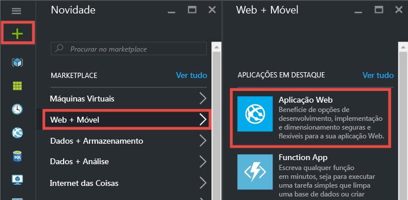
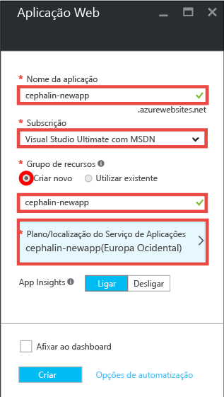
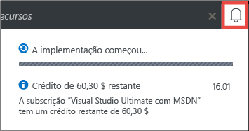
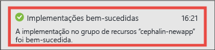
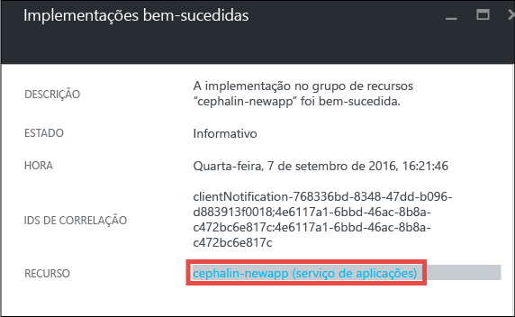
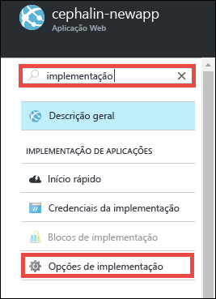
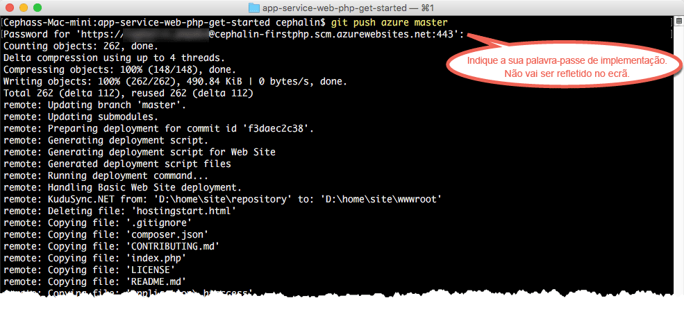

# Implementar a primeira aplicação Web PHP no Azure em cinco minutos
Este tutorial ajuda-o a implementar a sua primeira aplicação Web PHP no [Serviço de Aplicações do Azure](../app-service/app-service-value-prop-what-is.md).
Pode utilizar o Serviço de Aplicações para criar aplicações, [back-ends de aplicações móveis](/documentation/learning-paths/appservice-mobileapps/) e [aplicações API](../app-service-api/app-service-api-apps-why-best-platform.md).

Irá: 

* Criar uma aplicação Web no Serviço de Aplicações do Azure.
* Implementar código PHP de exemplo.
* Ver o seu código em execução em direto na produção.
* Atualizar a sua aplicação Web da mesma forma que [emitiria consolidações do Git](https://git-scm.com/docs/git-push).

## Pré-requisitos
* [Instalar o Git](http://www.git-scm.com/downloads). Executar o `git --version` a partir de uma nova linha de comandos do Windows, uma janela do PowerShell, uma shell do Linux ou um terminal OS X para se certificar de que a instalação é realizada com êxito.
* Obter uma conta do Microsoft Azure. Se não tiver uma conta, pode [inscrever-se numa avaliação gratuita](/pricing/free-trial/?WT.mc_id=A261C142F) ou [ativar os benefícios de subscritor do Visual Studio](/pricing/member-offers/msdn-benefits-details/?WT.mc_id=A261C142F).

> [!NOTE]
> Pode [Experimentar o Serviço de Aplicações](http://go.microsoft.com/fwlink/?LinkId=523751) sem uma conta do Azure. Crie uma aplicação de introdução e experimente-a durante uma hora, sem cartão de crédito nem compromissos.
> 
> 

## Criar uma aplicação Web
1. Inicie sessão no [portal do Azure](https://portal.azure.com) com a sua conta do Azure.
2. No menu à esquerda, clique em **Novo** > **Web + Móvel** > **Aplicação Web**.
   
    
3. No painel de criação da aplicação, utilize as seguintes definições para a sua nova aplicação:
   
   * **Nome da aplicação**: escreva um nome exclusivo.
   * **Grupo de recursos**: selecione **Criar novo** e dê um nome ao grupo de recursos.
   * **Plano do Serviço de Aplicações/Localização**: clique nele para configurar e, em seguida, clique em **Criar Novo** para definir o nome, a localização e o escalão de preço do plano do Serviço de Aplicações. Pode utilizar o escalão de preço **Gratuito**.
     
     Quando tiver terminado, o painel de criação da aplicação deverá este aspeto:
     
     
4. Clique em **Criar** na parte inferior. Pode clicar no ícone de **Notificação** na parte superior para ver o progresso.
   
    
5. Quando a implementação estiver concluída, deverá ver esta mensagem de notificação. Clique na mensagem para abrir o painel da implementação.
   
    
6. No painel **Implementação concluída com êxito**, clique na ligação **Recurso** para abrir o painel da sua nova aplicação Web.
   
    

## Implementar código para a sua aplicação Web
Agora, vamos implementar algum código no Azure através do Git.

1. No painel da aplicação Web, desloque-se para baixo até às **Opções de implementação** ou procure as mesmas e, em seguida, clique nestas. 
   
    
2. Clique em **Escolher Origem** > **Repositório de Git Local** > **OK**.
3. Novamente no painel da aplicação Web, clique em **Credenciais de implementação**.
4. Defina as suas credenciais de implementação e clique em **Guardar**.
5. Novamente no painel da aplicação Web, desloque-se até às **Propriedades** ou procure as mesmas e, em seguida, clique nestas. Junto ao **URL do Git**, clique no botão **Copiar**.
   
    
   
    Agora, está pronto para implementar código com o Git.
6. No terminal da linha de comandos, mude para um diretório de trabalho (`CD`) e clone a aplicação de exemplo desta forma:
   
        git clone https://github.com/Azure-Samples/app-service-web-php-get-started.git
   
    
   
    Para *&lt;github_sample_url>*, utilize um dos seguintes URLs, consoante a arquitetura da sua preferência:
7. Altere para o repositório da sua aplicação de exemplo. Por exemplo, 
   
        cd app-service-web-html-get-started
8. Configure o Git remoto para a sua aplicação Azure com o respetivo URL do Git, que copiou do Portal há alguns passos.
   
        git remote add azure <giturlfromportal>
9. Implemente o código de exemplo na sua aplicação do Azure tal como emitiria qualquer código com o Git:
   
        git push azure master
   
        
   
    Se utilizou uma das arquiteturas de linguagem, será apresentado um resultado diferente. Tal deve-se ao facto de que `git push` não só coloca código no Azure, como também aciona tarefas de implementação no motor de implementação. Se tiver algum package.json na raiz do projeto (repositório), o script de implementação restaura os pacotes necessários por si. Também pode [ativar a extensão de Compositor](web-sites-php-mysql-deploy-use-git.md#composer) para processar automaticamente ficheiros composer.json na sua aplicação PHP.

Já está! O código já está em execução em direto no Azure. No seu browser, navegue para http://*&lt;nomeaplic>*.azurewebsites.net para vê-lo em ação. 

## Efetuar atualizações à sua aplicação
Agora, pode utilizar o Git para emitir a partir da raiz do projeto (repositório) em qualquer altura para efetuar uma atualização ao site online. Pode fazê-lo tal como quando implementou o seu código pela primeira vez. Por exemplo, sempre que pretender emitir uma nova alteração que tenha testado localmente, basta executar os seguintes comandos a partir da raiz do projeto (repositório):

    git add .
    git commit -m "<your_message>"
    git push azure master

## Passos seguintes
[Crie, configure e implemente uma aplicação Web Laravel no Azure](app-service-web-php-get-started.md). Este tutorial irá permitir-lhe obter as competências básicas de que necessita para executar qualquer aplicação Web PHP no Azure, tais como:

* Criar e configurar aplicações no Azure a partir do PowerShell/Bash.
* Definir a versão do PHP.
* Utilizar um ficheiro de arranque que não se encontra no diretório de aplicações de raiz.
* Ativar a automatização do Compositor.
* Aceder a variáveis específicas do ambiente.
* Resolver erros comuns.

Em alternativa, faça mais com a sua primeira aplicação Web. Por exemplo:

* Experimente [outras formas de implementar o seu código no Azure](web-sites-deploy.md). Por exemplo, para implementar a partir de um dos seus repositórios do GitHub, só tem de selecionar **GitHub** em vez de **Repositório de Git Local** nas **Opções de implementação**.
* Eleve a sua aplicação do Azure ao nível seguinte. Autentique os seus utilizadores. Dimensione-a com base no pedido. Configure alguns alertas de desempenho. Tudo com apenas alguns cliques. Consulte [Adicionar funcionalidades à sua primeira aplicação Web](app-service-web-get-started-2.md).

<!--HONumber=Sep16_HO3-->

