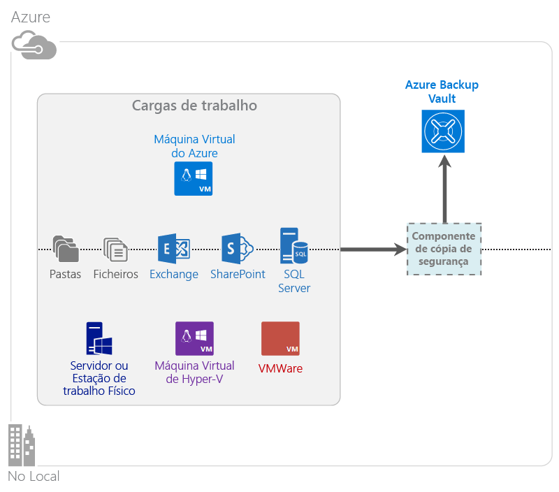

<properties
    pageTitle="O que é o Backup do Azure? | Microsoft Azure"
    description="Ao utilizar os Serviços de Recuperação e o Backup do Azure, pode criar cópias de segurança e restaurar dados e aplicações a partir de Servidores Windows, computadores cliente do Windows, servidores do System Center DPM e máquinas virtuais do Azure."
    services="backup"
    documentationCenter=""
    authors="Jim-Parker"
    manager="jwhit"
    editor="tysonn"
    keywords="cópia de segurança e restauro; serviços de recuperação; soluções de cópia de segurança"/>

<tags
    ms.service="backup"
    ms.workload="storage-backup-recovery"
    ms.tgt_pltfrm="na"
    ms.devlang="na"
    ms.topic="get-started-article"
    ms.date="07/21/2016"
    ms.author="jimpark; trinadhk"/>

# O que é o Backup do Azure?
O Backup do Azure é o serviço que utiliza para criar cópias de segurança e restaurar os dados no Microsoft cloud. Substitui a solução de cópia de segurança no local ou fora das instalações com uma solução baseada na nuvem que é fiável, segura e competitiva em termos de custos. Também ajuda a proteger os ativos que são executados na nuvem. O Backup do Azure fornece serviços de recuperação concebidos numa infraestrutura de nível internacional dimensionável, durável e altamente disponível.

[Veja uma descrição geral do vídeo do Backup do Azure](https://azure.microsoft.com/documentation/videos/what-is-azure-backup/)

## Porquê utilizar o Backup do Azure?
As soluções de cópia de segurança tradicionais evoluíram para tratar a nuvem como um ponto final semelhante a discos ou bandas. Embora esta abordagem seja simples, também é limitada. Não tira o máximo partido de uma plataforma em nuvem subjacente e traduz uma solução ineficaz e dispendiosa.
Em contraste, o Backup do Azure fornece todas as vantagens de uma solução de cópia de segurança na nuvem potente e acessível. Aqui estão algumas das principais vantagens que o Backup do Azure fornece.

| Funcionalidade | Vantagem |
| ------- | ------- |
| Gestão de armazenamento automática | Não são necessárias despesas de capital para dispositivos de armazenamento no local. O Backup do Azure atribui automaticamente e gere o armazenamento de cópia de segurança e utiliza um modelo de consumo de pagamento enquanto utiliza. |
| Dimensionamento ilimitado | Tire partido de garantias de elevada disponibilidade sem os custos gerais da manutenção e da monitorização. O Backup do Azure utiliza o poder subjacente e a escala da nuvem do Azure, com as suas capacidades de dimensionamento automático não intrusivas. |
| Várias de opções de armazenamento | Escolha o armazenamento de cópia de segurança com base nas necessidades:<li>Um blob de blocos de armazenamento localmente redundante é ideal para clientes que valorizam o preço e ainda ajuda a proteger dados contra falhas com o hardware local. <li>Um blob de blocos de armazenamento de georreplicação fornece mais três cópias num centro de dados emparelhado. Estas cópias adicionais ajudam a garantir que os dados de cópia de segurança estão altamente disponíveis, mesmo se ocorrer um desastre ao nível do site no Azure. |
| Transferência de dados ilimitada | Não existe qualquer cobrança para uma transferência de dados de saída durante uma operação de restauro a partir do Cofre de cópia de segurança. Os dados de entrada para o Azure também são gratuitos. Funciona com o serviço de importação onde estiver disponível. |
| Encriptação de dados | A encriptação de dados permite uma transmissão segura e o armazenamento dos dados de clientes na nuvem pública. A frase de acesso de encriptação é armazenada na origem e nunca é transmitida ou armazenada no Azure. A chave de encriptação é necessária para restaurar quaisquer dados e apenas o cliente tem acesso total aos dados no serviço. |  
| Cópia de segurança consistente com aplicações | As cópias de segurança consistentes com aplicações no Windows ajudam a garantir que as correções não são necessárias no momento do restauro, o que reduz o objetivo do tempo de recuperação. Isto permite que os clientes regressem ao estado de execução mais rapidamente. |
| Retenção de longa duração | Em vez de pagar soluções de cópia de segurança em banda fora das instalações, os clientes podem criar uma cópia de segurança no Azure, o que fornece uma solução apelativa semelhante a uma banda e a baixo custo. |

## Componentes do Backup do Azure
Uma vez que a Cópia de Segurança é uma solução de cópia de segurança híbrida, é composta por vários componentes que funcionam em conjunto para ativar a cópia de segurança ponto-a-ponto e restaurar os fluxos de trabalho.

### Cenários de implementação

| Componente | Pode ser implementado no Azure? | Pode ser implementado no local? | Armazenamento de destino suportado|
| --- | --- | --- | --- |
| Agente do Backup do Azure | 
**Sim**
 
O agente do Backup do Azure pode ser implementado em qualquer VM do Windows Server que é executada no Azure.
 | 
**Sim**
 
O agente de Cópia de Segurança pode ser implementado em qualquer máquina física ou VM do Windows Server.
 | 
Cofre do Backup do Azure
 |
| System Center Data Protection Manager (DPM) | 
**Sim**

Saiba mais sobre [como proteger cargas de trabalho no Azure utilizando o System Center DPM](http://blogs.technet.com/b/dpm/archive/2014/09/02/azure-iaas-workload-protection-using-data-protection-manager.aspx).
 | 
**Sim**
 
Saiba mais sobre [como proteger cargas de trabalho e VMs no datacenter](https://technet.microsoft.com/library/hh758173.aspx).
 | 
Disco ligado localmente,
 
Cofre do Backup do Azure,
 
banda (apenas no local)
 |
| Servidor do Backup do Azure | 
**Sim**

Saiba mais sobre [como proteger cargas de trabalho no Azure utilizando o Servidor do Backup do Azure](backup-azure-microsoft-azure-backup.md).
 | 
**Sim**
 
Saiba mais sobre [como proteger cargas de trabalho no Azure utilizando o Servidor do Backup do Azure](backup-azure-microsoft-azure-backup.md).
 | 
Disco ligado localmente,
 
Cofre do Backup do Azure
 |
| Backup do Azure (extensão da VM) | 
**Sim**

Parte dos recursos de infraestrutura do Azure 

Especializada para a [cópia de segurança da infraestrutura do Azure como máquinas virtuais do serviço (IaaS)](backup-azure-vms-introduction.md).
 | 
**Não**
 
Utilize o System Center DPM para efetuar a cópia de segurança das máquinas virtuais no datacenter.
 | 
Cofre do Backup do Azure
 |

### Vantagens e limitações ao nível do componente

| Componente | Vantagens | Limitações | Granularidade de recuperação |
| --- | --- | --- | --- |
| Agente do Backup do Azure (MARS) | <li>Pode criar cópias de segurança de ficheiros e pastas numa máquina com o sistema operativo Windows, seja física ou virtual (as VMs podem estar em qualquer parte no local ou no Azure)<li>Nenhum servidor de cópia de segurança separado necessário<li>Utiliza o Cofre do Backup do Azure | <li>Cópia de segurança três vezes por dia/restauro ao nível do ficheiro<li>Restauro apenas ao nível do ficheiro/pasta/volume, sem deteção de aplicações<li>Sem suporte para Linux | ficheiros/pastas/volumes |
| System Center Data Protection Manager | <li>Instantâneos da deteção de aplicações (VSS)<li>Total flexibilidade para quando efetuar cópias de segurança<li>Granularidade de recuperação (tudo)<li>Pode utilizar o cofre do Backup do Azure<li>Apoio técnico para Linux (se alojado no Hyper-V) | <li>Falta de suporte heterogéneo (cópia de segurança da VM de VMware, cópia de segurança da carga de trabalho do Oracle).  | ficheiros/pastas/volumes / VMs/aplicações |
| Servidor do Backup do Microsoft Azure | <li>Instantâneos da deteção de aplicações (VSS)<li>Total flexibilidade para quando efetuar cópias de segurança<li>Granularidade de recuperação (tudo)<li>Pode utilizar o cofre do Backup do Azure<li>Apoio técnico para Linux (se alojado no Hyper-V)<li>Não necessita de uma licença do System Center | <li>Falta de suporte heterogéneo (cópia de segurança da VM de VMware, cópia de segurança da carga de trabalho do Oracle).<li>Requer sempre a subscrição do Azure em direto<li>Sem suporte para cópia de segurança em fila | ficheiros/pastas/volumes / VMs/aplicações |
| Cópia de segurança da VM do IaaS do Azure | <li>Cópias de segurança nativas para o Windows/Linux<li>Não é necessária qualquer instalação do agente específico<li>Cópia de segurança ao nível dos recursos de infraestrutura sem ser necessária qualquer infraestrutura de cópia de segurança | <li>Cópia de segurança uma vez por dia/restauro ao nível do disco<li>Não é possível efetuar a cópia de segurança no local | VMs Todos os discos (utilizando o PowerShell) |

## Podem ser efetuadas cópias de segurança a que aplicações e cargas de trabalho?

| Carga de trabalho | Máquina de origem | Solução do Backup do Azure |
| --- | --- |---|
| Ficheiros e pastas | Windows Server | 
[Agente do Backup do Azure](backup-configure-vault.md),
 
[O System Center DPM](backup-azure-dpm-introduction.md) (+ o agente do Backup do Azure),
 
[Servidor do Backup do Azure](backup-azure-microsoft-azure-backup.md) (inclui o agente do Backup do Azure)
  |
| Ficheiros e pastas | Cliente Windows | 
[Agente do Backup do Azure](backup-configure-vault.md),
 
[O System Center DPM](backup-azure-dpm-introduction.md) (+ o agente do Backup do Azure),
 
[Servidor do Backup do Azure](backup-azure-microsoft-azure-backup.md) (inclui o agente do Backup do Azure)
  |
| Máquina virtual do Hyper-V (Windows) | Windows Server | 
[O System Center DPM](backup-azure-backup-sql.md) (+ o agente do Backup do Azure),
 
[Servidor do Backup do Azure](backup-azure-microsoft-azure-backup.md) (inclui o agente do Backup do Azure)
 |
| Máquina virtual do Hyper-V (Linux) | Windows Server | 
[O System Center DPM](backup-azure-backup-sql.md) (+ o agente do Backup do Azure),
 
[Servidor do Backup do Azure](backup-azure-microsoft-azure-backup.md) (inclui o agente do Backup do Azure)
  |
| Microsoft SQL Server | Windows Server | 
[O System Center DPM](backup-azure-backup-sql.md) (+ o agente do Backup do Azure),
 
[Servidor do Backup do Azure](backup-azure-microsoft-azure-backup.md) (inclui o agente do Backup do Azure)
  |
| Microsoft SharePoint | Windows Server | 
[O System Center DPM](backup-azure-backup-sql.md) (+ o agente do Backup do Azure),
 
[Servidor do Backup do Azure](backup-azure-microsoft-azure-backup.md) (inclui o agente do Backup do Azure)
   |
| Microsoft Exchange |  Windows Server | 
[O System Center DPM](backup-azure-backup-sql.md) (+ o agente do Backup do Azure),
 
[Servidor do Backup do Azure](backup-azure-microsoft-azure-backup.md) (inclui o agente do Backup do Azure)
   |
| VMs do IaaS do Azure (Windows) | - | [Backup do Azure (extensão da VM)](backup-azure-vms-introduction.md) |
| VMs do IaaS do Azure (Linux) | - | [Backup do Azure (extensão da VM)](backup-azure-vms-introduction.md) |

## Apoio técnico para Linux e ARM

| Componente | Apoio Técnico para ARM | Apoio Técnico para Linux (aprovado pelo Azure) |
| --- | --- | --- |
| Agente do Backup do Azure (MARS) | Sim | Nenhum (Apenas agente baseado no Windows) |
| System Center Data Protection Manager | Sim (Agente no convidado) | Apenas é possível a cópia de segurança consistente com ficheiros apenas no Hyper-V (Não na VM do Azure) |
| Servidor do Backup do Azure (MABS) | Sim (Agente no convidado) | Apenas é possível a cópia de segurança consistente com ficheiros apenas no Hyper-V (Não na VM do Azure) (Tal como no DPM) |
| Cópia de segurança da VM do IaaS do Azure | Sim | Sim |

[AZURE.INCLUDE [learn-about-deployment-models](../../includes/learn-about-deployment-models-include.md)]

## Criar cópias de segurança e Restaurar VMs do Premium Storage

O serviço de Backup do Azure agora protege VMs do Premium Storage.

### Criar cópia de segurança das VMs do Premium Storage

Durante a cópia de segurança das VMs do Premium Storage, o serviço de Cópia de Segurança cria uma localização de transição temporária na conta do Premium Storage. A localização de transição, com o nome "AzureBackup-", é igual ao tamanho total dos dados dos discos premium ligados à VM.

>[AZURE.NOTE] Não modifique ou edite a localização de transição.

Depois de a tarefa de cópia de segurança estar concluída, a localização de transição é eliminada. O preço do armazenamento utilizado para a localização de transição é consistente com todos os [Preços do Premium Storage](../storage/storage-premium-storage.md#pricing-and-billing).

### Restaurar VMs do Premium Storage

As VM de Armazenamento Premium podem ser restauradas para o Armazenamento Premium ou para o armazenamento normal. Restaurar um ponto de recuperação de uma VM do Premium Storage novamente para o Premium Storage é o processo normal de restauro. No entanto, pode ser económico restaurar um ponto de recuperação de uma VM do Premium Storage para o armazenamento standard. Este tipo de restauro pode ser utilizado se precisar de um subconjunto de ficheiros da VM.

## Funcionalidade
Estas cinco tabelas resumem como a funcionalidade de cópia de segurança é processada em cada componente.

### Storage

| Funcionalidade | Agente do Backup do Azure | System Center DPM | Servidor do Backup do Azure | Backup do Azure (extensão da VM) |
| ------- | --- | --- | --- | ---- |
| Cofre do Backup do Azure | ![Sim][green] | ![Sim][green] | ![Sim][green] | ![Sim][green] |
| Armazenamento em disco | | ![Sim][green] | ![Sim][green] |  |
| Armazenamento em banda | | ![Sim][green] |  | |
| Compressão (no cofre de cópia de segurança) | ![Sim][green] | ![Sim][green]| ![Sim][green] | |
| Cópia de segurança incremental | ![Sim][green] | ![Sim][green] | ![Sim][green] | ![Sim][green] |
| Eliminação de discos duplicados | | ![Parcialmente][yellow] | ![Parcialmente][yellow]| | |

O Cofre de cópia de segurança é o destino de armazenamento preferencial em todos os componentes. O System Center DPM e o Servidor do Backup fornecem também a opção para ter uma cópia de disco local. No entanto, apenas o System Center DPM disponibiliza a opção para escrever dados num dispositivo de armazenamento em banda.

#### Cópia de segurança incremental
Todos os componentes suportam a cópia de segurança incremental, independentemente do armazenamento de destino (disco, banda, cofre de cópia de segurança). A cópia de segurança incremental assegura que as cópias de segurança são eficientes ao nível do armazenamento e do tempo, transferindo apenas as alterações efetuadas desde a última cópia de segurança.

#### Compressão
As cópias de segurança estão comprimidas para reduzir o espaço de armazenamento necessário. O único componente que não utiliza a compressão é a extensão da VM. Com a extensão da VM, todos os dados de cópia de segurança são copiados da conta de armazenamento do cliente para o cofre de cópia de segurança na mesma região sem o comprimir. Embora a não utilização da compressão aumente ligeiramente o armazenamento utilizado, armazenar os dados sem compressão permite tempos de restauro mais rápidos.

#### Eliminação de duplicados
A eliminação de duplicados é suportada para o System Center DPM e o Servidor do Backup quando é [implementado numa máquina virtual do Hyper-V](http://blogs.technet.com/b/dpm/archive/2015/01/06/deduplication-of-dpm-storage-reduce-dpm-storage-consumption.aspx). A eliminação de duplicados é efetuada ao nível do anfitrião utilizando a eliminação de Windows Servers duplicados em discos rígidos virtuais (VHDs) que estão ligados à máquina virtual como o armazenamento de cópia de segurança.

>[AZURE.WARNING] A eliminação de duplicados não está disponível no Azure em qualquer um dos componentes de Cópia de segurança. Quando o System Center DPM e o Servidor do Backup são implementados no Azure, não é possível eliminar os discos de armazenamento ligados à VM duplicados.

### Segurança

| Funcionalidade | Agente do Backup do Azure | System Center DPM | Servidor do Backup do Azure | Backup do Azure (extensão da VM) |
| ------- | --- | --- | --- | ---- |
| Segurança de rede (para o Azure) | ![Sim][green] |![Sim][green] | ![Sim][green] | ![Parcialmente][yellow]|
| Segurança de dados (no Azure) | ![Sim][green] |![Sim][green] | ![Sim][green] | ![Parcialmente][yellow]|

Todo o tráfego de cópia de segurança dos seus servidores para o Cofre de cópia de segurança é encriptado utilizando a norma AES (Advanced Encryption Standard) 256. Os dados são enviados através de uma ligação HTTPS segura. Os dados de cópia de segurança também são armazenados no Cofre de cópia de segurança no formato encriptado. Apenas o cliente possui a frase de acesso para desbloquear estes dados. A Microsoft não pode desencriptar os dados de cópia de segurança em momento algum.

>[AZURE.WARNING] Apenas o cliente possui a chave utilizada para encriptar os dados de cópia de segurança. A Microsoft não mantém uma cópia no Azure e não tem qualquer acesso à chave. Se a chave está no local incorreto, a Microsoft não pode recuperar os dados de cópia de segurança.

A cópia de segurança das VMs do Azure necessita da configuração da encriptação *na* máquina virtual. Utilize o BitLocker nas máquinas virtuais do Windows e o **dm crypt** nas máquinas virtuais do Linux. O Backup do Azure não encripta automaticamente dados de cópia de segurança fornecidos através deste caminho.

### Cargas de trabalho suportadas

| Funcionalidade | Agente do Backup do Azure | System Center DPM | Servidor do Backup do Azure | Backup do Azure (extensão da VM) |
| ------- | --- | --- | --- | ---- |
| Máquina com o Windows Server – ficheiros e pastas | ![Sim][green] | ![Sim][green] | ![Sim][green] | |
| Máquina cliente do Windows – ficheiros e pastas | ![Sim][green] | ![Sim][green] | ![Sim][green] | |
| Máquina virtual do Hyper-V (Windows) | | ![Sim][green] | ![Sim][green] | |
| Máquina virtual do Hyper-V (Linux) | | ![Sim][green] | ![Sim][green] | |
| Microsoft SQL Server | | ![Sim][green] | ![Sim][green] | |
| Microsoft SharePoint | | ![Sim][green] | ![Sim][green] | |
| Microsoft Exchange  | | ![Sim][green] | ![Sim][green] | |
| Máquina virtual do Azure (Windows) | | | | ![Sim][green] |
| Máquina virtual do Azure (Linux) | | | | ![Sim][green] |

### Rede

| Funcionalidade | Agente do Backup do Azure | System Center DPM | Servidor do Backup do Azure | Backup do Azure (extensão da VM) |
| ------- | --- | --- | --- | ---- |
| Compressão de rede (para o servidor de cópia de segurança) | | ![Sim][green] | ![Sim][green] | |
| Compressão de rede (para o cofre de cópia de segurança) | ![Sim][green] | ![Sim][green] | ![Sim][green] | |
| Protocolo de rede (para o servidor de cópia de segurança) | | TCP | TCP | |
| Protocolo de rede (para o cofre de cópia de segurança) | HTTPS | HTTPS | HTTPS | HTTPS |

Uma vez que a extensão da VM lê os dados diretamente a partir da conta de armazenamento do Azure através da rede de armazenamento, não é necessário otimizar este tráfego. O tráfego é através da rede de armazenamento local no datacenter do Azure, portanto, não há grande necessidade de compressão devido a considerações de largura de banda.

Se estiver a efetuar uma cópia de segurança dos seus dados para um servidor de cópia de segurança (Servidor do Backup ou DPM), o tráfego do servidor primário para o servidor de cópia de segurança pode ser comprimido para poupar largura de banda.

#### Limitação de rede
O agente do Backup do Azure fornece a capacidade de limitação, o que lhe permite controlar como a largura de banda de rede é utilizada durante a transferência de dados. A limitação pode ser útil se precisar de efetuar uma cópia de segurança dos dados durante as horas de trabalho, mas não pretende que o processo de cópia de segurança interfira com outro tráfego de Internet. A limitação para a transferência de dados aplica-se às atividades de cópia de segurança e de restauro.

### Cópia de segurança e retenção

|  | Agente do Backup do Azure | System Center DPM | Servidor do Backup do Azure | Backup do Azure (extensão da VM) |
| --- | --- | --- | --- | --- |
| Frequência de cópia de segurança (para o cofre de cópia de segurança) | Três cópias de segurança por dia | Duas cópias de segurança por dia |Duas cópias de segurança por dia | Uma cópia de segurança por dia |
| Frequência de cópia de segurança (para o disco) | Não aplicável | 
A cada 15 minutos para o SQL Server
 
A cada hora para outras cargas de trabalho
 | 
A cada 15 minutos para o SQL Server
 
A cada hora para outras cargas de trabalho
 |Não aplicável |
| Opções de retenção | Diariamente, semanalmente, mensalmente, anualmente | Diariamente, semanalmente, mensalmente, anualmente | Diariamente, semanalmente, mensalmente, anualmente |Diariamente, semanalmente, mensalmente, anualmente |
| Período de retenção | Até 99 anos | Até 99 anos | Até 99 anos | Até 99 anos |
| Pontos de recuperação no Cofre de cópia de segurança | Ilimitado | Ilimitado | Ilimitado | Ilimitado |
| Pontos de recuperação no disco local | Não aplicável | 64 para Servidores de Ficheiros  448 para Servidores de Aplicações | 64 para Servidores de Ficheiros  448 para Servidores de Aplicações |Não aplicável |
| Pontos de recuperação em banda | Não aplicável | Ilimitado | Não aplicável | Não aplicável |

## O que é o ficheiro de credenciais do cofre?

O ficheiro de credenciais do cofre é um certificado gerado pelo portal para cada cofre de cópia de segurança. O portal, em seguida, carrega a chave pública para o Access Control Service (ACS). A chave privada é fornecida para o utilizador ao transferir as credenciais e, em seguida, introduzida durante o registo da máquina. A chave privada autentica a máquina para enviar dados de cópia de segurança para um cofre identificado no serviço de Backup do Azure.

As credenciais do cofre são utilizadas apenas durante o fluxo de trabalho do registo. É da responsabilidade do cliente garantir que o ficheiro de credenciais do cofre não é comprometido. Se ficarem às mãos de qualquer utilizador não autorizado, o ficheiro de credenciais do cofre pode ser utilizado para registar outras máquinas contra o mesmo cofre. No entanto, uma vez que os dados de cópia de segurança são encriptados utilizando uma frase de acesso que pertencem apenas ao cliente, os dados de cópia de segurança existentes não podem ficar comprometidos. Para atenuar esta preocupação, as credenciais do cofre estão definidas para expirar dentro de 48 horas. Embora possa transferir as credenciais do cofre de um cofre de cópia de segurança quantas vezes quiser, apenas o ficheiro mais recente é aplicável durante o fluxo de trabalho do registo.

## Qual é a diferença entre o Backup do Azure e o Azure Site Recovery?
Muitos clientes confundem a recuperação de cópia de segurança com a recuperação após desastre. Ambos capturam dados e fornecem a semântica de restauro, mas as respetivas propostas de valor inerentes são diferentes.

O Backup do Azure efetua uma cópia de segurança dos dados no local e na nuvem. O Azure Site Recovery coordena a replicação da máquina virtual e do servidor físico, a ativação pós-falha e a reativação pós-falha. Ambos os serviços são importantes porque a sua solução de recuperação após desastre tem de manter os seus dados seguros e recuperáveis (Cópia de Segurança) *e* manter as cargas de trabalho disponíveis (Recuperação de Sites) quando ocorrerem falhas.

Os seguintes conceitos ajudam-no a tomar decisões importantes acerca da cópia de segurança e da recuperação após desastre.

| Conceito | Detalhes | Cópia de segurança | Recuperação após desastre (DR) |
| ------- | ------- | ------ | ----------------- |
| Objetivo de ponto de recuperação (RPO) | A quantidade de perda de dados aceitável se uma recuperação tiver de ser efetuada. | As soluções de cópia de segurança têm uma grande variação no respetivo RPO aceitável. Normalmente, as cópias de segurança de máquinas virtuais têm um RPO de um dia, enquanto as cópias de segurança de bases de dados têm RPOs tão baixos como 15 minutos. | As soluções de recuperação após desastre têm RPOs baixas. A cópia da DR pode atrasar-se em alguns segundos ou minutos. |
| Objetivo de tempo de recuperação (RTO) | A quantidade de tempo que demora a concluir uma recuperação ou um restauro. | Devido ao RPO maior, a quantidade de dados que uma solução de cópia de segurança necessita para processar é, normalmente, muito mais elevada, o que resulta em RTOs maiores. Por exemplo, pode demorar dias para restaurar dados de bandas, consoante o tempo que demora a transportar a banda a partir de uma localização fora das instalações. | As soluções de recuperação após desastre têm RTOs menores porque são estão mais sincronizadas com a origem. Não é necessário processar tantas as alterações. |
| Retenção | O tempo durante o qual os dados precisam de ser armazenados | Para cenários que necessitem de uma recuperação operacional (danos em dados, eliminação de ficheiros inadvertida, falha de SO), os dados de cópia de segurança são, normalmente, mantidos durante 30 dias ou menos. A partir de um ponto de vista da conformidade, os dados poderão ter de ser armazenados durante meses ou mesmo anos. Dados de cópia de segurança são, idealmente, adequados para o arquivo nestes casos. | A recuperação após desastre apenas precisa de dados da recuperação operacional, que demoram, normalmente, algumas horas ou um dia, no máximo. Devido à captura de dados detalhados utilizada em soluções de DR, não se recomenda a utilização de dados de DR para uma retenção de longo prazo. |

## Passos seguintes

Experimente um Backup do Azure simples. Para obter instruções, consulte um destes tutoriais:

- [Experimentar o Backup do Azure](backup-try-azure-backup-in-10-mins.md)
- [Experimentar o Backup da VM do Azure](backup-azure-vms-first-look.md)

Uma vez que estes tutoriais o ajudam a efetuar uma cópia de segurança rapidamente, mostram-lhe apenas o caminho mais direto para efetuar a cópia de segurança dos seus dados. Para obter informações adicionais sobre o tipo de cópia de segurança que pretende efetuar, consulte:

- [Cópia de segurança da máquina Windows](backup-configure-vault.md)
- [Cópia de segurança de cargas de trabalho de aplicações](backup-azure-microsoft-azure-backup.md)
- [Cópia de segurança das VMs do IaaS do Azure](backup-azure-vms-prepare.md)

[green]: ./media/backup-introduction-to-azure-backup/green.png
[yellow]: ./media/backup-introduction-to-azure-backup/yellow.png
[red]: ./media/backup-introduction-to-azure-backup/red.png

<!--HONumber=Aug16_HO1-->

