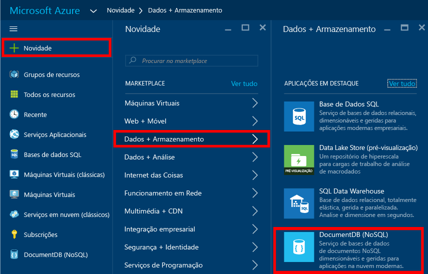
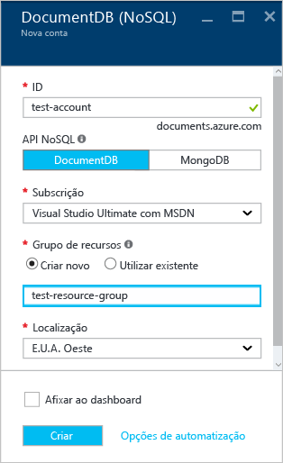
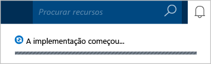
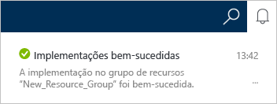
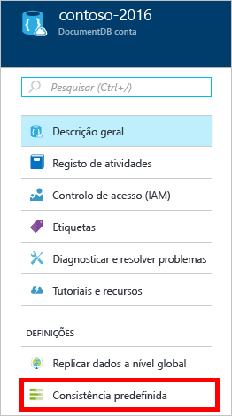
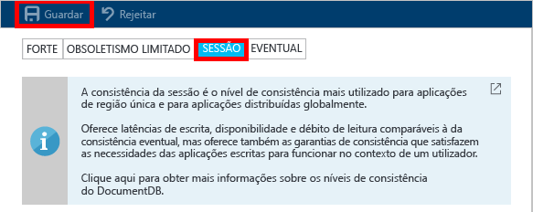

# Como criar uma conta NoSQL do DocumentDB através do portal do Azure
> [!div class="op_single_selector"]
> * [Portal do Azure](documentdb-create-account.md)
> * [CLI do Azure e Azure Resource Manager](documentdb-automation-resource-manager-cli.md)
> 
> 

Para criar uma base de dados com o Microsoft Azure DocumentDB, tem de:

* Ter uma conta do Azure. Pode obter uma [conta do Azure gratuita](https://azure.microsoft.com/free) caso ainda não tenha uma. 
* Criar uma conta do DocumentDB.  

Pode criar uma conta do DocumentDB através do portal do Azure, de modelos do Azure Resource Manager ou da interface de linha de comandos (CLI) do Azure. Este artigo mostra como criar uma conta do DocumentDB com o portal do Azure. Para criar uma conta através do Azure Resource Manager ou da CLI do Azure, veja o artigo [Automatizar a criação da conta de base de dados do DocumentDB](documentdb-automation-resource-manager-cli.md).

Ainda não conhece o DocumentDB? Veja [este](https://azure.microsoft.com/documentation/videos/create-documentdb-on-azure/) vídeo de quatro minutos da autoria de Scott Hanselman para saber como pode realizar as tarefas mais comuns no portal online.

1. Inicie sessão no [portal do Azure](https://portal.azure.com/).
2. Na Barra de índice, clique em **Novo**, clique em **Bases de Dados** e, em seguida, clique em **DocumentDB (NoSQL)**. 
   
     
3. No painel **Nova conta**, especifique a configuração pretendida para a conta do DocumentDB.
   
    
   
   * Na caixa **ID**, introduza um nome para identificar a conta do DocumentDB.  Quando o **ID** é validado, é apresentada uma marca de verificação verde na caixa **ID**. O valor **ID** torna-se o nome de anfitrião no URI. O **ID** pode conter apenas minúsculas, números, o caráter '-' e deve ter entre 3 e 50 carateres. Tenha em atenção que *documents.azure.com* é acrescentado ao nome do ponto final que escolher, sendo que o resultado final irá tornar-se o ponto final da conta do DocumentDB.
   * Na caixa **API NoSQL**, selecione o modelo de programação a utilizar:
     
     * **DocumentDB**: a API do DocumentDB está disponível através dos [SDKs](documentdb-sdk-dotnet.md) de .NET, Java, Node.js, Python e JavaScript, assim como de [REST](https://msdn.microsoft.com/library/azure/dn781481.aspx) HTTP, e disponibiliza acesso programático a todas as funcionalidades do DocumentDB. 
     * **MongoDB**: o DocumentDB também oferece [suporte ao nível do protocolo](documentdb-protocol-mongodb.md) para APIs do **MongoDB**. Quando escolhe a opção API do MongoDB, pode utilizar SDKs e [ferramentas](documentdb-mongodb-mongochef.md) existentes do MongoDB para comunicar com o DocumentDB. Pode [mover](documentdb-import-data.md) as suas aplicações do MongoDB existentes para utilizar o DocumentDB, [sem necessidade de realizar alterações de código](documentdb-connect-mongodb-account.md), e tirar partido de uma base de dados totalmente gerida como serviço, com dimensionamento ilimitado, replicação global e outras capacidades.
   * Para **Subscrição**, selecione a subscrição do Azure que quer utilizar para a conta do DocumentDB. Se a sua conta tiver apenas uma subscrição, essa conta é selecionada por predefinição.
   * Em **Grupo de Recursos**, selecione ou crie um grupo de recursos para a sua conta do DocumentDB.  Por predefinição, é criado um novo grupo de recursos. Para obter mais informações, veja [Utilizar o portal do Azure para gerir os recursos do Azure](../azure-portal/resource-group-portal.md).
   * Utilize a **Localização** para especificar a localização geográfica na qual vai alojar a sua conta do DocumentDB. 
4. Assim que as novas opções da conta do DocumentDB estiverem configuradas, clique em **Criar**. Para verificar o estado da implementação, verifique o hub de Notificações.  
   
     
   
   
5. Depois da criação da conta do DocumentDB, esta está pronta para ser utilizada com as predefinições. A consistência predefinida da conta do DocumentDB está definida como **Sessão**.  Pode ajustar a consistência predefinida. Para tal, clique em **Consistência Predefinida** no menu do recurso. Para saber mais sobre os níveis de consistência que o DocumentDB oferece, veja o artigo [Níveis de consistência no DocumentDB](documentdb-consistency-levels.md).
   
     
   
     

[Como: criar uma conta do DocumentDB]: #Howto
[Passos seguintes?]: #NextSteps
[documentdb-gerir]:../articles/documentdb/documentdb-manage.md

## Passos seguintes
Agora que tem uma conta do DocumentDB, o passo seguinte consiste em criar uma coleção e uma base de dados do DocumentDB. 

Para criar uma nova coleção e base de dados, utilize um dos seguintes métodos:

* O portal do Azure, conforme descrito em [Criar uma coleção do DocumentDB através do portal do Azure](documentdb-create-collection.md).
* Os tutoriais totalmente inclusivos, os quais incluem dados de exemplo: [.NET](documentdb-get-started.md), [.NET MVC](documentdb-dotnet-application.md), [Java](documentdb-java-application.md), [Node.js](documentdb-nodejs-application.md) ou [Python](documentdb-python-application.md).
* O código de exemplo em [.NET](documentdb-dotnet-samples.md#database-examples), [Node.js](documentdb-nodejs-samples.md#database-examples) ou [Python](documentdb-python-samples.md#database-examples) disponível no GitHub.
* Os SDKs de [.NET](documentdb-sdk-dotnet.md), [Node.js](documentdb-sdk-node.md), [Java](documentdb-sdk-java.md), [Python](documentdb-sdk-python.md) e [REST](https://msdn.microsoft.com/library/azure/mt489072.aspx).

Depois de criar a base de dados e a coleção, tem de [adicionar documentos](documentdb-view-json-document-explorer.md) às coleções.

Depois de colocar documentos numa coleção, pode utilizar o [DocumentDB SQL](documentdb-sql-query.md) para [executar consultas](documentdb-sql-query.md#executing-queries) em relação aos seus documentos. Pode executar consultas com o [Explorador de Consultas](documentdb-query-collections-query-explorer.md) no portal, a [API REST](https://msdn.microsoft.com/library/azure/dn781481.aspx) ou um dos [SDKs](documentdb-sdk-dotnet.md).

### Saiba mais
Para saber mais sobre o DocumentDB, explore estes recursos:

* [Percurso de aprendizagem para o DocumentDB](https://azure.microsoft.com/documentation/learning-paths/documentdb/)
* [Conceitos e modelo hierárquico de recursos do DocumentDB](documentdb-resources.md)

<!--HONumber=Nov16_HO2-->

