# Introdução ao Azure Monitor
O Azure Monitor é o serviço de plataforma que fornece uma única origem para a monitorização de recursos do Azure. Com o Azure Monitor, pode visualizar, consultar, encaminhar, arquivar e tomar medidas relativamente a métricas e registos provenientes de recursos no Azure. Pode trabalhar com estes dados utilizando o painel do portal do Monitor, [Cmdlets do PowerShell do Monitor](insights-powershell-samples.md), a [CLI de Várias Plataformas](insights-cli-samples.md)ou [APIs REST do Azure Monitor](https://msdn.microsoft.com/library/dn931943.aspx). Neste artigo, explicaremos alguns dos principais componentes do Azure Monitor, utilizando o portal para demonstração.

## Instruções
1. No portal, navegue até **Mais serviços** e localize a opção **Monitor**. Clique no ícone de estrela para adicionar esta opção à sua lista de favoritos, para que esteja sempre facilmente acessível a partir da barra de navegação à esquerda.

    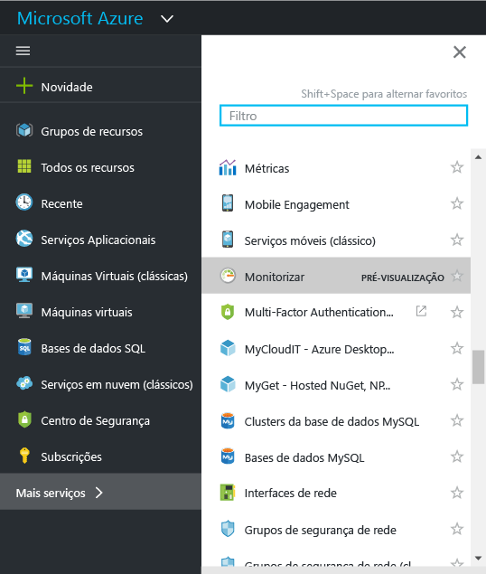
2. Clique na opção **Monitor** para abrir o painel **Monitor**. Este painel reúne todas as suas definições e dados de monitorização numa vista consolidada. É aberto pela primeira vez para a secção **Registo de atividade**.

    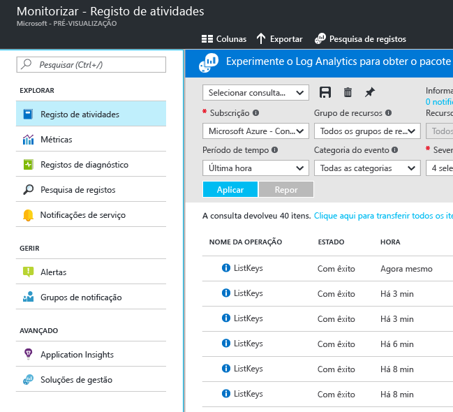

    O Azure Monitor tem três categorias básicas de dados de monitorização: **registo de atividade**, **métricas** e **registos de diagnóstico**.
3. Clique em **Registo de atividade** para certificar-se de que a secção de registo de atividade é apresentada.

    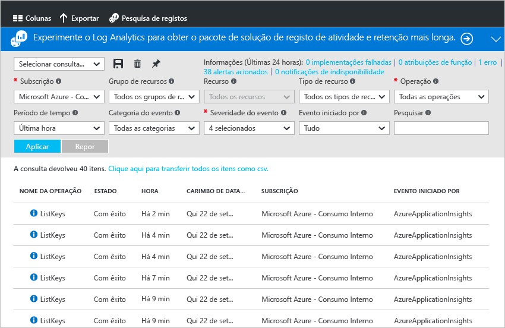

    O [**registo de atividade**](monitoring-overview-activity-logs.md) descreve todas as operações executadas nos recursos da sua subscrição. Ao utilizar o Registo de Atividade, pode determinar “o quê, quem e quando” para qualquer operação de criação, atualização ou eliminação dos recursos da sua subscrição. Por exemplo, o Registo de Atividade informa-o quando uma aplicação Web tiver sido interrompida, e por quem. Os eventos do Registo de Atividade são armazenados na plataforma e ficam disponíveis para consulta durante 90 dias.

    Pode criar e guardar consultas para filtros comuns, e afixar as consultas mais importantes num dashboard do portal para saber sempre se ocorreram eventos que correspondem os critérios.
4. Filtre a vista para um grupo de recursos específico ao longo da última semana e clique no botão **Guardar**.

    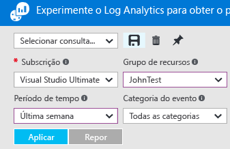
5. Agora, clique no botão **Afixar**.

    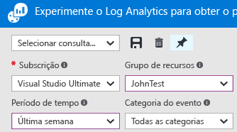

    A maioria das vistas nestas instruções pode ser afixada num dashboard. Isto ajuda a criar uma única origem de informações para dados operacionais nos seus serviços.
6. Volte ao dashboard. Pode agora pode ver que a consulta (e o número de resultados) é apresentada no seu dashboard. Isto é útil se pretender ver rapidamente as ações de perfil de alta ocorridas recentemente na sua subscrição, por exemplo foi atribuída uma nova função ou uma VM foi eliminada.

    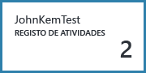
7. Volte ao mosaico **Monitor** e clique na secção **Métricas**. Primeiro tem de selecionar um recurso de filtragem e selecionando utilizando as opções de lista pendente na parte superior do painel.

    

    Todos os recursos do Azure emitem [**métricas**](monitoring-overview-metrics.md). Esta vista reúne todas as métricas num único painel no ecrã, para que possa compreender facilmente o desempenho dos recursos. Além disso, consulte a nossa marca [nova métrica charting experiência](https://aka.ms/azuremonitor/new-metrics-charts) ao clicar no **métricas (pré-visualização)** separador.
8. Assim que tiver selecionado um recurso, todas as métricas disponíveis são apresentadas no lado esquerdo do painel. Pode criar um gráfico de várias métricas ao mesmo tempo, selecionando as métricas e modificando o tipo de gráfico e o intervalo de tempo. Também pode ver todos os alertas de métricas definidos neste recurso.

    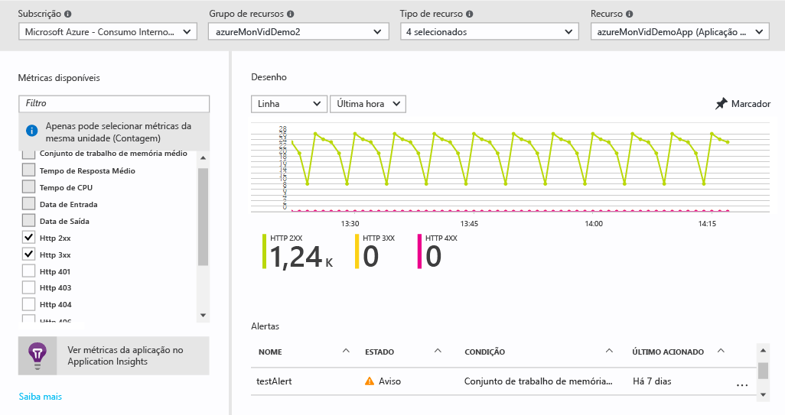

   > [!NOTE]
   > Algumas métricas só ficam disponíveis ao ativar o [Application Insights](../application-insights/app-insights-overview.md) e/ou o Diagnóstico do Azure do Windows ou Linux no seu recurso.
   >
   >
9. Quando estiver satisfeito com o seu gráfico, pode utilizar o botão **Afixar** para afixá-lo ao dashboard.
10. Volte ao painel **Monitor** e clique em **Registos de diagnóstico**.

    

    [**Registos de diagnóstico**](monitoring-overview-of-diagnostic-logs.md) e registos emitidos *por* um recurso que fornece dados sobre o funcionamento desse recurso. Por exemplo, os registos de Contadores de Regras de Grupo de Segurança de Rede e de Fluxo de Trabalho de Aplicação Lógica são ambos tipos de registos de diagnóstico. Estes registos podem ser armazenados numa conta de armazenamento, transmitidos em fluxo para um Hub de Eventos e/ou enviados para o [Log Analytics](../log-analytics/log-analytics-overview.md). O Log Analytics é o produto de informações operacionais da Microsoft para pesquisa e alertas avançados.

    No portal, pode visualizar e filtrar uma lista de todos os recursos na sua subscrição para identificar se têm registos de diagnóstico ativados.
11. Clique num recurso no painel de registos de diagnóstico. Se os registos de diagnóstico estiverem a ser armazenados numa conta de armazenamento, irá ver uma lista de registos por hora que pode transferir diretamente.

    

    Também pode clicar em **Definições de Diagnóstico**, que lhe permite configurar ou modificar as definições de arquivo para uma conta de armazenamento, transmitir para Hubs de Eventos ou enviar para uma área de trabalho do Log Analytics.

    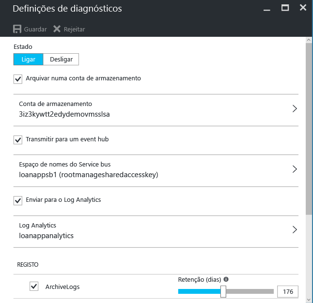

    Se tiver configurado registos de diagnóstico para o Log Analytics, então pode procurá-los na secção **Pesquisa de Registos** do portal.
12. Navegue para a secção **Alertas** do painel Monitor.

    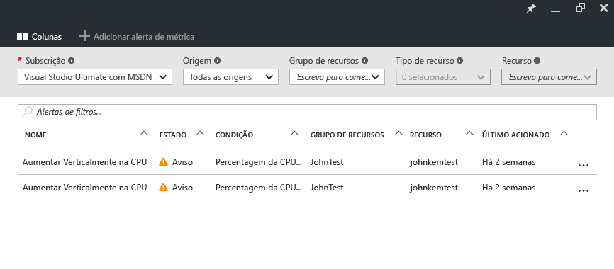

    Aqui, pode gerir todos os [**alertas**](monitoring-overview-alerts.md) dos recursos do Azure. Isto inclui alertas nas métricas, eventos de registo de atividade, testes web do Application Insights (localizações) e o diagnóstico Application Insights. Os alertas podem acionar o envio de um e-mail ou de um HTTP POST para um URL do webhook.
13. Clique em **Adicionar alerta de métricas** para criar um alerta.

    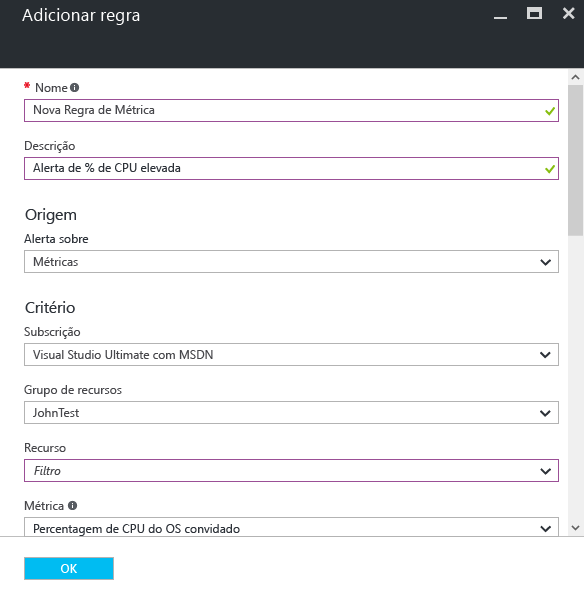

    Pode depois afixar um alerta ao dashboard para ver facilmente o estado em qualquer altura.

    Monitor do Azure também tem agora [ **quase em tempo real de alertas métricas**](https://aka.ms/azuremonitor/near-real-time-alerts)(pré-visualização) que pode ser avaliado com uma frequência como tão baixa como a cada minuto!
    
14. A secção Monitor também inclui ligações para aplicações do [Application Insights](../application-insights/app-insights-overview.md) e soluções de gestão do [Log Analytics](../log-analytics/log-analytics-overview.md). Estes outros produtos da Microsoft têm uma profunda integração com o Azure Monitor.
15. Se não estiver a utilizar o Application Insights ou o Log Analytics, provavelmente o Azure Monitor tem uma parceria com os seus produtos atuais de monitorização, registo e alertas. Veja a nossa [página de parceiros](monitoring-partners.md) para obter uma lista completa e instruções sobre como integrar.

Ao seguir estes passos e ao afixar todos os mosaicos relevantes num dashboard, pode criar vistas completas das sua aplicação e infraestrutura, como a seguinte:

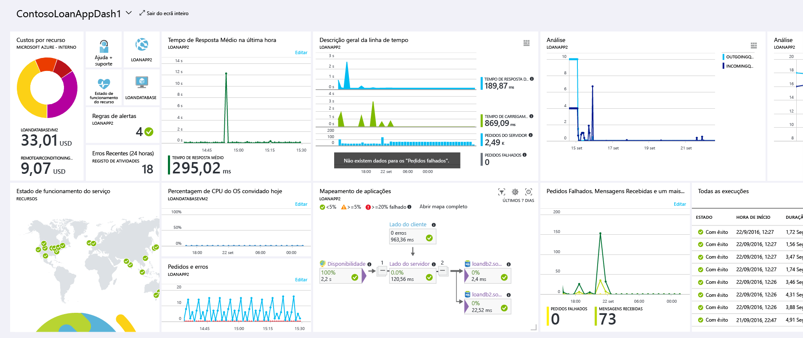

## Passos seguintes
* Leia a [Descrição geral do Azure Monitor](monitoring-overview.md)
