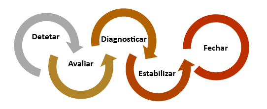
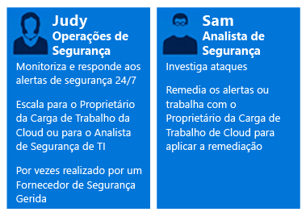
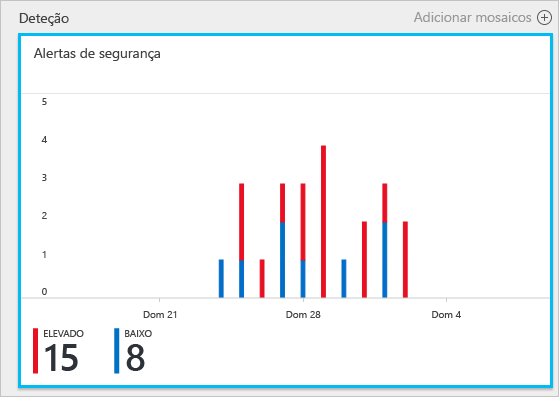
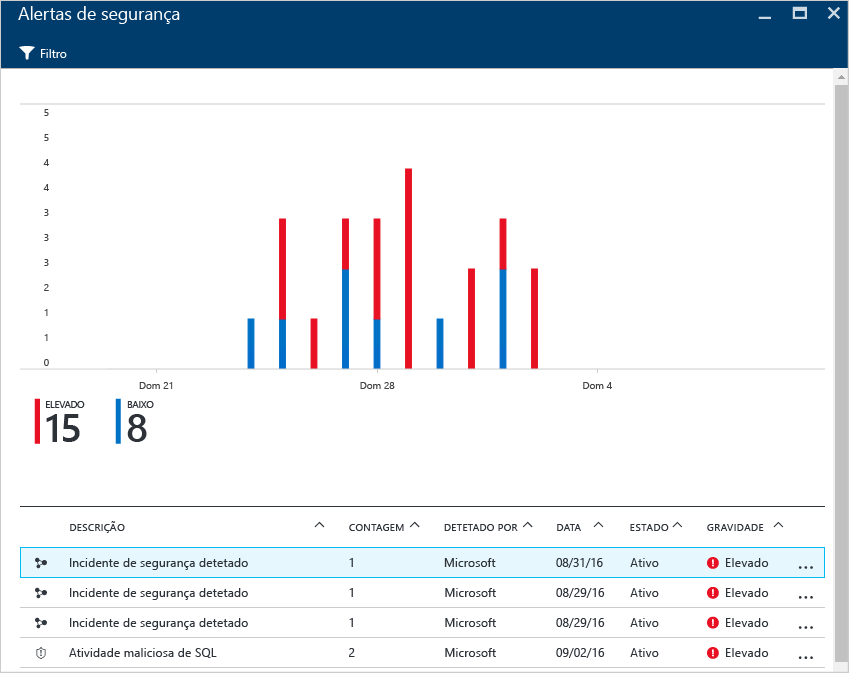
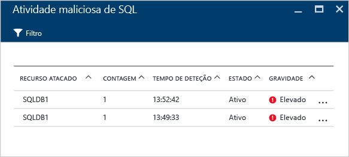
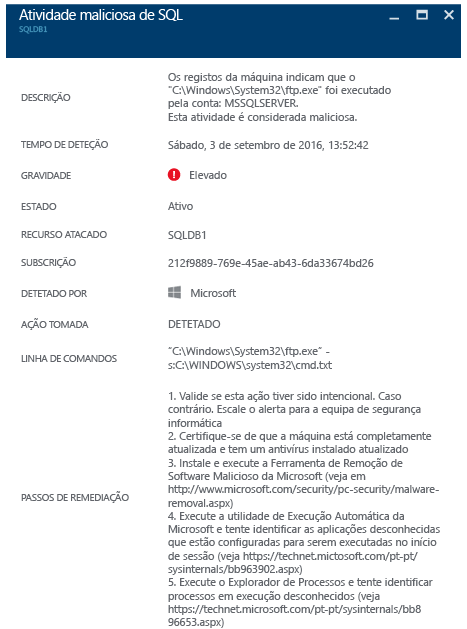

# Utilizar o Centro de Segurança do Azure para resposta a incidentes
Muitas organizações só aprendem a responder a incidentes de segurança depois de sofrerem um ataque. Para reduzir os custos e os danos, é importante ter um plano de resposta a incidentes implementado antes que ocorra um ataque. Pode utilizar o Centro de segurança do Azure em várias fases de uma resposta a incidentes.

## Planeamento de resposta a incidentes
Um plano eficaz depende de três capacidades principais: conseguir proteger, detetar e responder a ameaças. A proteção está relacionada com a prevenção de incidentes, a deteção com a identificação precoce de ameaças, a resposta diz respeito à expulsão de um atacante e a recuperação de sistemas para minimizar as consequências decorrentes de uma violação.

Este artigo irá utilizar as fases de resposta a incidentes de segurança com base no artigo [Resposta de Segurança do Microsoft Azure na Nuvem](https://gallery.technet.microsoft.com/Azure-Security-Response-in-dd18c678), conforme mostrado no diagrama seguinte:

Pode utilizar o Centro de Segurança durante as fases de Deteção, Avaliação e Diagnóstico. Eis exemplos de como o Centro de Segurança pode ser útil durante as três fases iniciais da resposta a incidentes:

* **Detetar**: reveja a primeira indicação de uma investigação de eventos.
  * Exemplo: reveja a verificação inicial a indicar que foi gerado um alerta de segurança de alta prioridade no dashboard do Centro de Segurança.
* **Avaliar**: efetue a avaliação inicial para obter mais informações sobre a atividade suspeita.
  * Exemplo: obtenha mais informações sobre o alerta de segurança.
* **Diagnosticar**: realize uma investigação técnica e identifique as estratégias de contenção, atenuação e solução.
  * Exemplo: siga os passos de remediação descritos pelo Centro de Segurança nesse alerta de segurança específico.

O cenário que se segue mostra como tirar partido do Centro de Segurança durante as fases de Deteção, Avaliação e Diagnóstico/Resposta de um incidente de segurança. No Centro de Segurança, um [incidente de segurança](security-center-incident.md) é uma agregação de todos os alertas de um recurso que são alinhados com padrões de [cadeia de eliminação](https://blogs.technet.microsoft.com/office365security/addressing-your-cxos-top-five-cloud-security-concerns/). Os incidentes são apresentados no mosaico e no painel [Alertas de segurança](security-center-managing-and-responding-alerts.md). Um incidente apresenta a lista de alertas relacionados, o que lhe permite obter mais informações sobre cada ocorrência. O Centro de Segurança apresenta também alertas de segurança autónomos, que podem ser igualmente utilizados para identificar atividades suspeitas.

## Cenário
A Contoso migrou recentemente alguns dos recursos no local para o Azure, incluindo algumas cargas de trabalho de linha de negócio baseadas em máquinas virtuais e bases de dados SQL. De momento, a CSIRT (Equipa de Resposta a Incidentes de Segurança Informática) da Contoso tem dificuldade em investigar problemas de segurança porque as informações de segurança não estão integradas com as respetivas ferramentas atuais de resposta a incidentes. Esta falta de integração apresenta um problema durante a fase de Deteção (demasiados falsos positivos), bem como durante as fases de Avaliação e Diagnóstico. Como parte desta migração, eles decidem se pretendem que o Centro de Segurança os ajude a resolver este problema.

A primeira fase desta migração foi concluída após a integração de todos os recursos e a aceitação de todas as recomendações de segurança do Centro de Segurança. O Contoso CSIRT é o ponto central para lidar com incidentes de segurança informática. A equipa consiste num grupo de pessoas com responsabilidades para lidar com qualquer incidente de segurança. Os membros da equipa têm deveres claramente definidos para se certificar de que nenhuma área de resposta é deixada sem cobertura.

Para efeitos deste cenário, vamos concentrar-nos nas funções das seguintes pessoas que fazem parte da CSIRT da Contoso:

A Constança está nas operações de segurança. As responsabilidades dela incluem:

* Monitorização e capacidade de resposta contínuas a ameaças de segurança.
* Escalonamento para o proprietário da carga de trabalho na nuvem ou analista de segurança, conforme necessário.

Samuel é um analista de segurança e as suas responsabilidades incluem:

* Investigar ataques.
* Resolver alertas.
* Trabalhar com proprietários de cargas de trabalho para determinar e aplicar atenuações.

Como pode ver, a Constança e o Samuel têm responsabilidades diferentes e devem trabalhar em conjunto para partilharem as informações do Centro de Segurança.

## Solução recomendada
Uma vez que a Constança e o Samuel têm funções diferentes, eles vão utilizar diferentes áreas do Centro de Segurança para obter informações relevantes para as respetivas atividades diárias. A Constança vai utilizar **Alertas de segurança** como parte da respetiva monitorização diária.

A Constança vai utilizar Alertas de segurança durante as fases de Deteção e Avaliação. Depois de a Constança terminar a avaliação inicial, ela poderá escalar o problema para Samuel se for necessária investigação adicional. Neste momento, o Samuel vai ter de utilizar as informações fornecidas pelo Centro de Segurança, por vezes em conjunto com outras origens de dados, para avançar para a fase de Diagnóstico.

## Como implementar esta solução
Para saber como utilizaria o Centro de Segurança do Azure num cenário de resposta a incidentes, vamos seguir os passos de Constança nas fases de Deteção e Avaliação e, em seguida, ver o que faz Samuel para diagnosticar o problema.

### Diagnosticar e Avaliar fases de resposta a incidentes
A Constança iniciou sessão no portal do Azure e está a trabalhar na consola do Centro de Segurança. Como parte das respetivas atividades de monitorização diária, ela iniciou a revisão dos alertas de segurança de alta prioridade, efetuando os seguintes passos:

1. Clique no mosaico **Alertas de segurança** e aceda ao painel **Alertas de segurança**.
    

   > [!NOTE]
   > Para efeitos deste cenário, Constança vai efetuar uma avaliação sobre o alerta de atividade SQL maliciosa, conforme indicado na imagem anterior.
   >
   >
2. Clique em **Atividade SQL maliciosa** e reveja os recursos atacados no painel **Atividade SQL maliciosa**: 

    Neste painel, Constança pode tomar notas sobre os recursos atacados, o número de ataques e quando foram detetados.
3. Clique no **recurso atacado** para obter mais informações sobre este ataque.

Depois de ler a descrição, Constança tem a certeza de que não se trata de um falso positivo e que deve escalar este caso para Samuel.

### Diagnosticar a fase de resposta a incidentes
Samuel recebe o caso de Constança e começa a rever os passos de remediação que o Centro de Segurança sugeriu.

### Recursos adicionais
As empresas que utilizam a respetiva solução de SIEM (gestão de informações e eventos de segurança) durante o processo de investigação também podem [integrar o Centro de Segurança com a respetiva solução](security-center-integrating-alerts-with-log-integration.md). Pode também integrar os registos de auditoria do Azure e os eventos de segurança da máquina virtual (VM) com a [ferramenta de integração de registo do Azure](https://blogs.msdn.microsoft.com/azuresecurity/2016/07/21/microsoft-azure-log-integration-preview/). Para investigar um ataque, pode utilizar esta informação em conjunto com as informações fornecidas pelo Centro de Segurança. Também pode utilizar a funcionalidade de [investigação](https://docs.microsoft.com/azure/security-center/security-center-investigation) do Centro de Segurança para determinar a origem de incidentes.

## Conclusão
A criação de uma equipa antes de ocorrer um incidente é muito importante para a sua organização e irá influenciar positivamente como os incidentes são processados. Ter as ferramentas certas para monitorizar recursos pode ajudar a esta equipa a tomar medidas precisas para resolver um incidente de segurança. As [capacidades de deteção](security-center-detection-capabilities.md) do Centro de Segurança vão ajudar as TI a responder rapidamente a incidentes de segurança e a resolver problemas de segurança.
