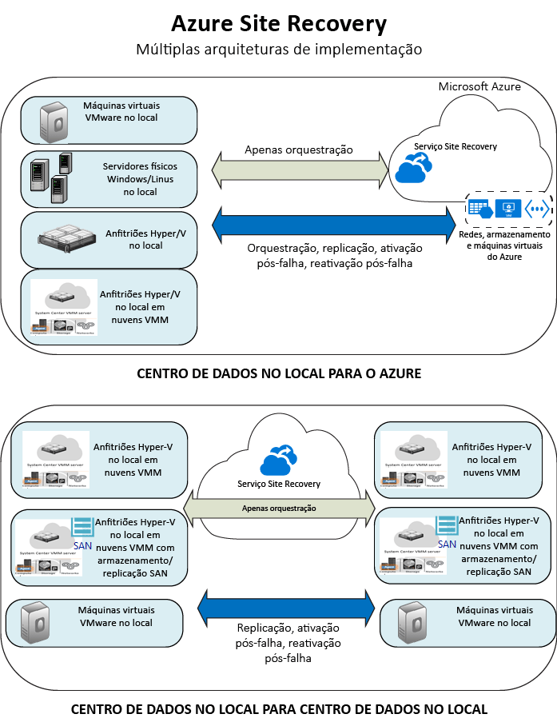

# O que é a Recuperação de Sites?
Bem-vindo ao serviço do Azure Site Recovery! Este artigo fornece uma descrição geral rápida do Site Recovery.

A sua organização necessita de uma estratégia de continuidade empresarial e de recuperação após desastre (BCDR) que mantém as aplicações e dados seguros e disponíveis durante o período de indisponibilidade planeado e imprevisto, e recupera as condições de trabalho normais com a maior brevidade possível.

O Site Recovery contribui para a estratégia BCDR orquestrando a replicação de máquinas virtuais no local e os servidores físicos. Replique VMs e servidores a partir de um datacenter local primário para a nuvem (Azure) ou para um datacenter secundário.

Quando ocorrem falhas no site principal, faz-se a ativação pós-falha para o site secundário para manter acessíveis e disponíveis as cargas de trabalho. A localização principal é reativada quando se retomam as operações normais.

## Recuperação de Sites no Portal do Azure
O Azure tem dois [modelos de implementação](../azure-resource-manager/resource-manager-deployment-model.md) diferentes para criar e trabalhar com os recursos. O modelo do Azure Resource Manager e o modelo de gestão de serviços clássico. O Azure também tem dois portais. O [portal Clássico do Azure](https://manage.windowsazure.com/) e o [portal do Azure](https://portal.azure.com).

* O Site Recovery pode ser implementado no Portal Clássico e no Portal do Azure.
* No Portal Clássico do Azure, pode suportar a Recuperação de Sites com o modelo clássico de gestão de serviços.
* No Portal do Azure, pode suportar as implementações do modelo clássico ou do Resource Manager.

As informações contidas neste artigo aplicam-se às implementações do Portal Clássico do Azul e do Portal do Azure. Assinalámos diferenças quando aplicável.

## Por que motivo implementar a Recuperação de Sites?
Saiba o que a Recuperação de Sites pode fazer pela sua empresa:

* **Simplificar a BCDR**— pode replicar, realizar a ativação pós-falha e recuperar várias cargas de trabalho a partir de uma única localização no Portal do Azure. A recuperação de sites orquestra a replicação e a ativação pós-falha, sem intercetar dados da aplicação.
* **Proporciona replicação flexível** – pode replicar quaisquer cargas de trabalho em execução em VMs Hyper-V, VMs VMware e servidores físicos do Windows/Linux suportados.
* **Eliminar um datacenter secundário**— pode replicar cargas de trabalho para o Azure, em vez de replicar para um site secundário. Esta ação elimina o custo e a complexidade de manter um datacenter secundário. Os dados replicados são armazenados no Armazenamento do Azure, com a resiliência que oferece. Quando ocorre a ativação pós-falha, as VMs do Azure são criadas com os dados.
* **Execute testes de replicação simples** – pode facilmente executar ativações pós-falha de teste que admitem manobras de recuperação após desastre, sem afetar os ambientes de produção.
* **Ativação pós-falha e recuperação**— pode executar as ativações pós-falha planeadas para as falhas esperadas sem nenhuma perda de dados ou as ativações pós-falha não planeadas com perda mínima de dados (dependendo da frequência de replicação), perante desastres inesperados. Pode fazer a reativação pós-falha para o site primário ao estar disponível novamente.
* **Ativação pós-falha da várias VMs**— Pode configurar o plano de recuperação que abranja scripts e runbooks de automatização do Azure. Os planos de recuperação permitem-lhe modelar e personalizar a ativação pós-falha e a recuperação de aplicações de vários escalões que estão distribuídas por várias VMs.
* **Integrar com tecnologias BCDR existentes** – a Recuperação de Sites é integrada com outras tecnologias BCDR. Por exemplo, pode utilizar a Recuperação de Sites para proteger o back-end do SQL Server de cargas de trabalho corporativas, incluindo suporte nativo para o SQL Server AlwaysOn gerir a ativação pós-falha de grupos de disponibilidade.

## Que regiões são suportadas?
Para saber mais sobre as regiões em que o Azure Site Recovery está disponível, consulte [aqui](https://azure.microsoft.com/en-us/regions/services/) 

## O que posso replicar?
Apresentamos a seguir um resumo daquilo que pode replicar com a Recuperação de Sites.

| **REPLICAR** | **REPLICAR PARA** |
| --- | --- |
| VMs VMware no local |[Azure](site-recovery-vmware-to-azure-classic.md)   [Site secundário](site-recovery-vmware-to-vmware.md) |
| VMs Hyper-V no local geridas nas nuvens VMM |[Azure](site-recovery-vmm-to-azure.md)   [Site secundário](site-recovery-vmm-to-vmm.md) |
| VMs Hyper-V no local geridas nas nuvens VMM, com armazenamento SAN |[Site secundário](site-recovery-vmm-san.md) |
| VMs Hyper-V no local, sem VMM |[Azure](site-recovery-hyper-v-site-to-azure.md) |
| Servidores físicos do Windows/Linux no local |[Azure](site-recovery-vmware-to-azure-classic.md)   [Site secundário](site-recovery-vmware-to-vmware.md) |

## Como é que o Site Recovery protege as cargas de trabalho?
O Site Recovery fornece replicação com suporte para aplicações para que as cargas de trabalho e as aplicações continuem em execução de uma forma consistente quando ocorrerem falhas.

* **Instantâneos consistentes com a aplicação** – os computadores replicam através de instantâneos consistentes com a aplicação para aplicações de uma única ou múltiplas camadas. Para além da captura de dados do disco, a captura de instantâneos consistentes com aplicações retém todos os dados na memória e todas as transações no processo.
* **Replicação quase síncrona** – o Site Recovery fornece a frequência de replicação de apenas 30 segundos para Hyper-V e replicação contínua para VMware.
* **Planos de recuperação flexíveis**— pode criar e personalizar planos de recuperação com scripts externos e ações manuais. A integração com runbooks da Automatização do Azure permite-lhe recuperar uma pilha de aplicação completa com um único clique.
* **Integração com o SQL Server AlwaysOn** – pode gerir a ativação pós-falha de grupos de disponibilidade utilizando planos de recuperação.
* **Biblioteca de Automatização** – uma biblioteca de Automatização do Azure completa fornece scripts específicos de aplicação, prontos para produção, que podem ser transferidos e integrados com a Recuperação de Sites.
* **Gestão de rede simples** – a gestão de rede avançada na Recuperação de Sites e no Azure simplifica os requisitos de rede da aplicação, incluindo a reserva de endereços IP, a configuração de balanceadores de carga e a integração do Gestor de Tráfego do Azure para alternância de rede eficiente.

## Passos seguintes
* Leia mais em [Que cargas de trabalho pode proteger a Recuperação de Sites?](site-recovery-workload.md)
* Saiba mais sobre a arquitetura de Recuperação de Sites em [Como funciona a Recuperação de Sites?](site-recovery-components.md)

<!--HONumber=Feb17_HO4-->

