<properties
    pageTitle="Tutorial de Base de Dados SQL: criar uma base de dados SQL | Microsoft Azure"
    description="Saiba como configurar um servidor lógico de Base de dados SQL, uma regra de firewall do servidor, uma base de dados SQL e dados de exemplo. Além disso, saiba como ligar-se com ferramentas de cliente, configurar utilizadores e como configurar uma regra de firewall de base de dados."
    keywords="tutorial de base de dados sql, criar uma base de dados sql"
    services="sql-database"
    documentationCenter=""
    authors="CarlRabeler"
    manager="jhubbard"
    editor=""/>

<tags
    ms.service="sql-database"
    ms.workload="data-management"
    ms.tgt_pltfrm="na"
    ms.devlang="na"
    ms.topic="hero-article"
    ms.date="09/07/2016"
    ms.author="carlrab"/>

# Tutorial de Base de Dados SQL: criar uma base de dados SQL em minutos utilizando o portal do Azure

> [AZURE.SELECTOR]
- [Portal do Azure](sql-database-get-started.md)
- [C#](sql-database-get-started-csharp.md)
- [PowerShell](sql-database-get-started-powershell.md)

Neste tutorial, irá aprender a utilizar o Portal do Azure para:

- Criar uma base de dados SQL do Azure com dados de exemplo.
- Crie uma regra de firewall ao nível do servidor para um único endereço IP ou para um intervalo de endereços IP.

Pode efetuar estas mesmas tarefas utilizando o [C#](sql-database-get-started-csharp.md) ou o [PowerShell](sql-database-get-started-powershell.md).

[AZURE.INCLUDE [Login](../../includes/azure-getting-started-portal-login.md)]

## Criar a sua primeira base de dados SQL do Azure 

1. Se não estiver atualmente ligado, ligue-se ao [Portal do Azure](http://portal.azure.com).
2. Clique em **Novo**, clique em **Dados + Armazenamento** e, em seguida, localize **Base de Dados SQL**.

    

3. Clique em **Base de Dados SQL** para abrir o painel Base de Dados SQL. O conteúdo neste painel varia consoante o número de subscrições e dos objetos existentes (como, por exemplo, servidores existentes).

    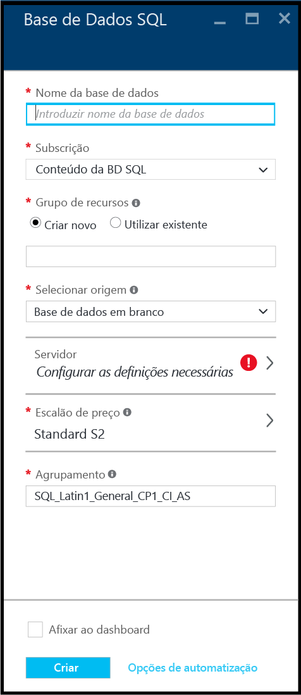

4. Na caixa de texto **Nome da base de dados**, forneça um nome para a sua primeira base de dados, como, por exemplo, "minha-base-de-dados". Uma marca de verificação verde indica que forneceu um nome válido.

    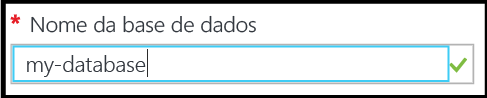

5. Se tiver várias subscrições, selecione uma.
6. Em **Grupo de recursos**, clique em **Criar novo** e forneça um nome para o seu primeiro grupo de recursos, como, por exemplo, "meu-grupo-de-recursos". Uma marca de verificação verde indica que forneceu um nome válido.

    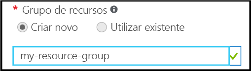

7. Em **Selecionar origem**, clique em **Exemplo** e, em seguida, em **Selecionar exemplo**, clique em **AdventureWorksLT [V12]**.

    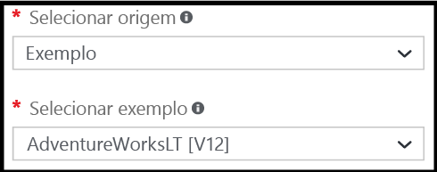

8. Em **Servidor**, clique em **Configurar definições necessárias**.

    

9. No painel Servidor, clique em **Criar um novo servidor**. É criada uma base de dados SQL do Azure dentro de um objeto de servidor, que pode ser um novo servidor ou um servidor existente.

    

10. Consulte o painel **Novo servidor** para compreender as informações que tem de fornecer para o seu novo servidor.

    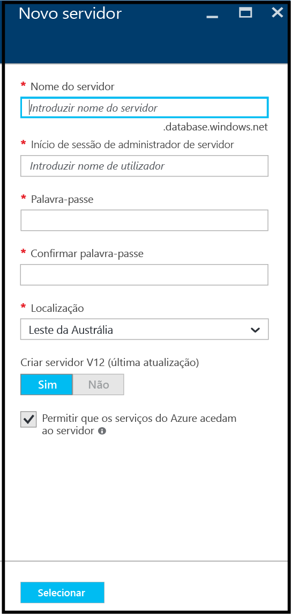

11. Na caixa de texto **Nome do servidor**, forneça um nome para o seu primeiro servidor, como, por exemplo, "meu-novo-objeto-de-servidor". Uma marca de verificação verde indica que forneceu um nome válido.

    
 
12. Em **Início de sessão de administrador do servidor**, forneça um nome de utilizador para o início de sessão do administrador para este servidor, como, por exemplo, "minha-conta-de-administrador". Este início de sessão é conhecido como o início de sessão do principal do servidor. Uma marca de verificação verde indica que forneceu um nome válido.

    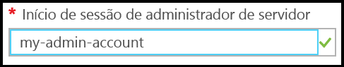

13. Em **Palavra-passe** e **Confirmar palavra-passe**, forneça uma palavra-passe para o início de sessão do principal do servidor como, por exemplo, "p@ssw0rd1". Uma marca de verificação verde indica que forneceu uma palavra-passe válida.

    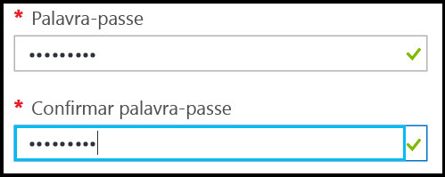
 
14. Em **Localização**, selecione um datacenter adequado à sua localização como, por exemplo, "Leste da Austrália".

    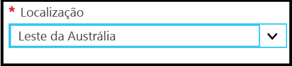

15. Em **Criar servidor V12 (atualização mais recente), tenha em atenção que apenas tem a opção de criar uma versão atual do servidor SQL do Azure.

    

16. Note que, por predefinição, a caixa de verificação **Permitir que os serviços do Azure acedam ao servidor** está selecionada e que não pode ser alterada aqui. Esta é uma opção avançada. Pode alterar esta definição nas definições da firewall do servidor para este objeto de servidor, embora tal não seja necessário na maior parte dos cenários.

    

17. No painel Novo servidor, reveja as suas seleções e, em seguida, clique em **Selecionar** para selecionar este novo servidor para a nova base de dados.

    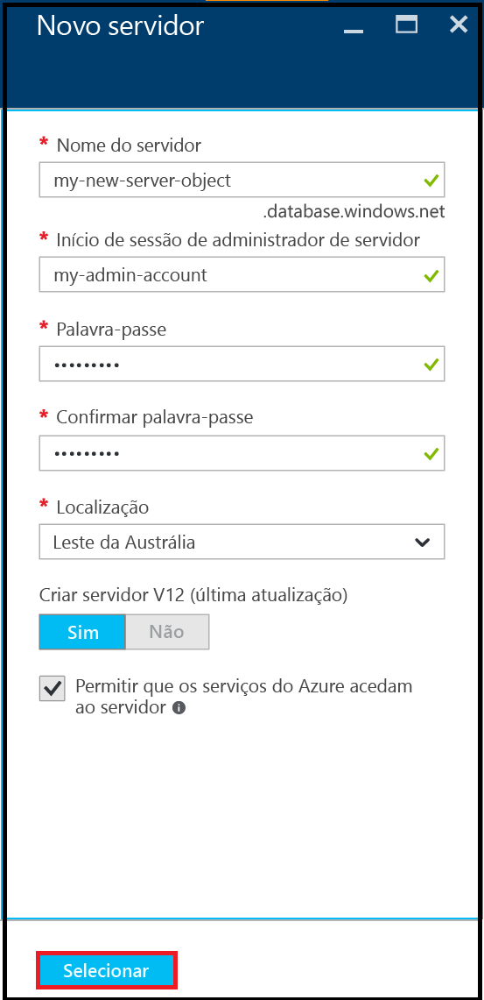

18. No painel Base de Dados SQL, em **Escalão de preço**, clique em **S2 Standard** e, em seguida, clique em **Básico** para escolher o escalão de preço menos dispendioso para a sua primeira base de dados. Pode sempre alterar o escalão de preço mais tarde.

    

19. No painel Base de Dados SQL, reveja as suas seleções e, em seguida, clique em **Criar** para criar o seu primeiro servidor e a sua primeira base de dados. Os valores que forneceu são validados e a implementação é iniciada.

    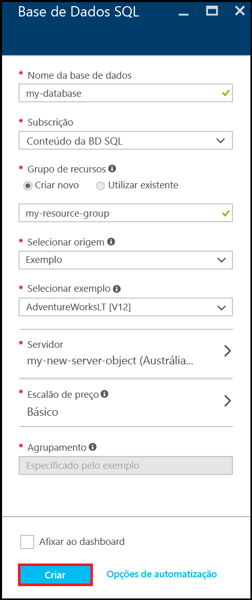

20. Na barra de ferramentas do portal, clique nos itens de **Notificações** para verificar o estado da implementação.

    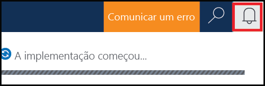

>[AZURE.IMPORTANT]Quando tiver concluído a implementação, o novo servidor e base de dados SQL do Azure são criados no Azure. Não poderá ligar ao seu novo servidor ou base de dados através das ferramentas do SQL Server até criar uma regra de firewall de servidor para abrir a firewall da Base de Dados SQL a ligações exteriores ao Azure.

[AZURE.INCLUDE [Create server firewall rule](../../includes/sql-database-create-new-server-firewall-portal.md)]

## Passos seguintes
Agora que concluiu este tutorial de Base de Dados SQL e criou uma base de dados com alguns dados de exemplo, está pronto para explorar, utilizando as suas ferramentas favoritas.

- Se estiver familiarizado com o Transact-SQL e o SQL Server Management Studio (SSMS), saiba como [Ligar e consultar uma base de dados SQL com SSMS](sql-database-connect-query-ssms.md).

- Se tem conhecimentos de Excel, saiba como [Ligar a uma base de dados SQL no Azure com o Excel](sql-database-connect-excel.md).

- Se estiver pronto para iniciar a codificação, escolha a linguagem de programação em [Bibliotecas de ligação para Base de Dados SQL e SQL Server](sql-database-libraries.md).

- Se pretender mover as bases de dados SQL Server no local para o Azure, consulte [Migrar uma base de dados para a Base de Dados SQL](sql-database-cloud-migrate.md) para saber mais.

- Se pretender carregar alguns dados para uma nova tabela a partir de um ficheiro CSV utilizando a ferramenta de linha de comandos BCP, veja [Carregar dados para a Base de Dados SQL a partir de um ficheiro CSV com o BCP](sql-database-load-from-csv-with-bcp.md).

- Se quiser começar a explorar a segurança da Base de Dados SQL do Azure, veja o artigo [Introdução à segurança](sql-database-get-started-security.md)

## Recursos adicionais

[O que é a Base de Dados SQL?](sql-database-technical-overview.md)

<!----HONumber=Sep16_HO3-->

