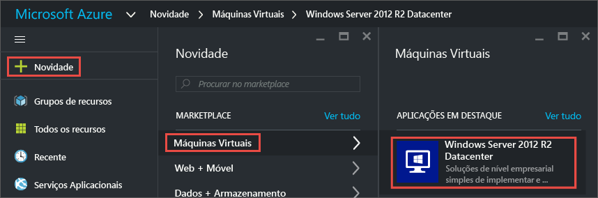
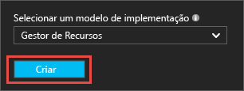
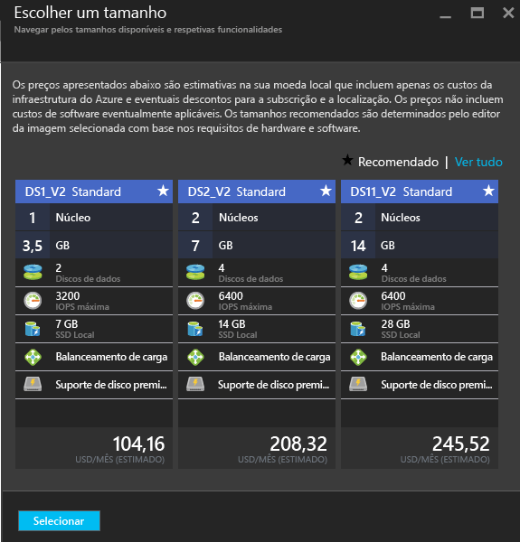
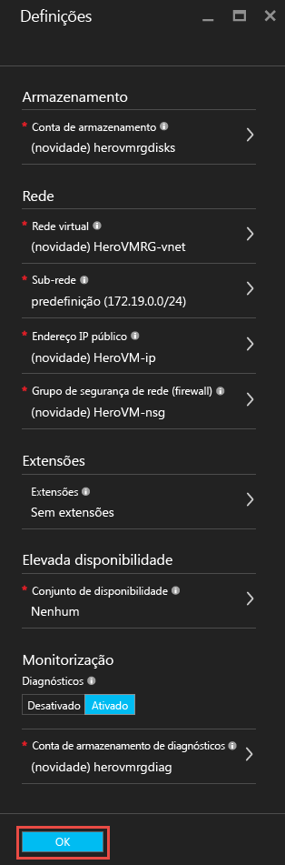
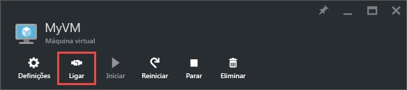
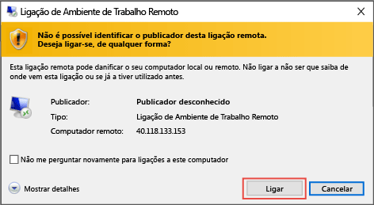
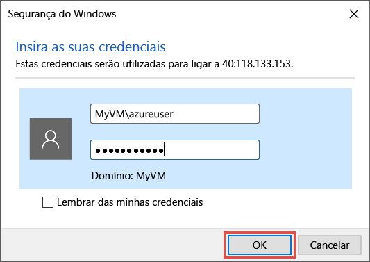
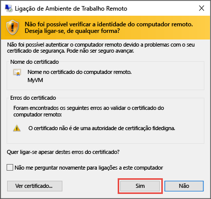

# Criar a sua primeira máquina virtual do Windows no Portal do Azure
Este tutorial mostra-lhe como é fácil criar uma máquina virtual (VM) do Windows em apenas alguns minutos através utilizando o Portal do Azure.  

Se não tiver uma subscrição do Azure, crie uma [conta gratuita](https://azure.microsoft.com/free/) antes de começar.

## Selecione a imagem VM do marketplace
Utilizamos uma imagem do Windows Server 2016 Datacenter como exemplo, mas esta é apenas uma das muitas imagens que o Azure oferece. As suas opções de imagem dependem da sua subscrição. Por exemplo, estão disponíveis algumas imagens de ambiente de trabalho para [Subscritores MSDN](https://azure.microsoft.com/pricing/member-offers/msdn-benefits-details/?WT.mc_id=A261C142F).

1. Inicie sessão no [Portal do Azure](https://portal.azure.com).
2. No canto superior esquerdo, clique em **Novo** > **Computação** > **Windows Server 2016 Datacenter**.
   
    
3. No painel **Windows Server 2016 Datacenter**, em **Selecionar um modelo de implementação**, verifique se o **Resource Manager** está selecionado. Clique em **Criar**.
   
    

## Criar a máquina virtual do Windows
Depois de selecionar a imagem, pode utilizar as predefinições e criar rapidamente a máquina virtual.

1. No painel **Noções básicas**, introduza um **Nome** para a máquina virtual. Neste exemplo, *HeroVM* é o nome da máquina virtual. O nome tem de ter entre 1-15 carateres e não pode conter carateres especiais.
2. Introduza um **Nome de utilizador** e uma **Palavra-passe** forte que será utilizada para criar uma conta local na VM. A conta local é utilizada para iniciar sessão e gerir a VM. Neste exemplo, *azureuser* é o nome de utilizador.
   
    A palavra-passe tem de ter entre 8 e 123 carateres e cumprir três dos quatro requisitos de complexidade seguintes: um caráter em letra minúscula, um caráter em letra maiúscula, um número e um caráter especial. Saiba mais sobre os [requisitos de nomes de utilizador e palavras-passe](virtual-machines-windows-faq.md#what-are-the-username-requirements-when-creating-a-vm).

3. Selecione um [Grupo de recursos](../azure-resource-manager/resource-group-overview.md#resource-groups) ou escreva o nome para um novo. Neste exemplo, *HeroVMRG* é o nome do grupo de recursos.

4. Selecione uma **Localização** para o datacenter do Azure. Neste exemplo, *E.U.A. Leste** é a localização. 

4. Quando tiver terminado, clique em **OK** para continuar para a secção seguinte. 
   
    
5. Escolha o [tamanho](virtual-machines-windows-sizes.md?toc=%2fazure%2fvirtual-machines%2fwindows%2ftoc.json) de uma VM e, em seguida, clique em **Selecionar** para continuar. Neste exemplo, *DS1_V2 Standard* é o tamanho da VM.
   
    
6. No painel **Definições**, pode alterar as opções de armazenamento e de rede. Para este tutorial, aceite as predefinições. Se tiver selecionado um tamanho da máquina virtual que o suporte, pode experimentar o Armazenamento Premium do Azure ao selecionar **Premium (SSD)** em **Tipo de disco**. Quando terminar de efetuar alterações, clique em **OK**.
   
    
7. Clique em **Resumo** para rever as opções. Quando vir a mensagem **A validação passou**, clique em **OK**.
   
    
8. Enquanto o Azure cria a máquina virtual, pode clicar em **Máquinas Virtuais**, à esquerda, para controlar o progresso. Quando a VM tiver sido criada, o estado será alterado para **Em execução**.

## Ligar à máquina virtual e iniciar sessão
1. À esquerda, clique em **Máquinas Virtuais**.
2. Selecione a máquina virtual na lista.
3. No painel da máquina virtual, clique em **Ligar**. Este procedimento cria e transfere um ficheiro de protocolo RDP (Remote Desktop Protocol) (ficheiro .rdp) que é como um atalho para ligar à sua máquina. Pode querer guardar o ficheiro no ambiente de trabalho para facilitar o acesso. **Abra** este ficheiro para ligar à VM.
   
    
4. Recebe um aviso a informar que o .rdp é de um publicador desconhecido. Isto é normal. Na janela Ambiente de Trabalho Remoto, clique em **Ligar** para continuar.
   
    
5. Na janela de Segurança do Windows, escreva o nome de utilizador e a palavra-passe para a conta local que criou quando criou a VM. O nome de utilizador é introduzido como *vmname*&#92;*nome de utilizador* e, em seguida, clique em **OK**.
   
    
6. Vai receber um aviso a informar que não é possível verificar o certificado. Isto é normal. Clique em **Sim** para verificar a identidade da máquina virtual e concluir o início de sessão.
   
   

Caso se depare com problemas ao tentar ligar, veja [Troubleshoot Remote Desktop connections to a Windows-based Azure Virtual Machine (Resolver problemas de ligações ao Ambiente de Trabalho Remoto para uma Máquina Virtual do Azure baseada no Windows)](virtual-machines-windows-troubleshoot-rdp-connection.md?toc=%2fazure%2fvirtual-machines%2fwindows%2ftoc.json).

Agora, pode trabalhar com a máquina virtual tal como faria com qualquer outro servidor.

## Opcional: pare a VM
É uma boa ideia parar a VM para não serem cobrados encargos quando, na verdade, não está a utilizá-la. Basta clicar em **Parar** e, em seguida, clicar em **Sim**.

Clique no botão **Iniciar** para reiniciar a VM quando estiver pronto para a utilizar novamente.

## Passos seguintes
* Pode experimentar a nova VM [instalando o IIS](virtual-machines-windows-hero-role.md?toc=%2fazure%2fvirtual-machines%2fwindows%2ftoc.json). Este tutorial também mostra como abrir a porta 80 ao tráfego web a receber utilizando um grupo de segurança de rede (NSG). 
* Também pode [criar uma VM do Windows utilizando o PowerShell](virtual-machines-windows-ps-create.md?toc=%2fazure%2fvirtual-machines%2fwindows%2ftoc.json) ou [criar uma máquina virtual do Linux](virtual-machines-linux-quick-create-cli.md?toc=%2fazure%2fvirtual-machines%2flinux%2ftoc.json) utilizando a CLI do Azure.
* Se estiver interessado em automatizar as implementações, consulte [Criar uma máquina virtual do Windows utilizando um modelo do Resource Manager](virtual-machines-windows-ps-template.md?toc=%2fazure%2fvirtual-machines%2fwindows%2ftoc.json).

<!--HONumber=Feb17_HO3-->

