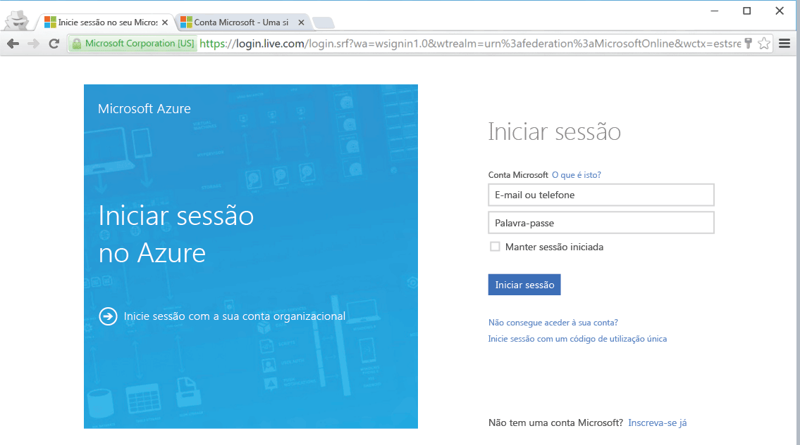

<!--
includes/azure-include-getting-started-v12portal-gettings-an-account.md

Latest Freshness check:  2016-04-11 , carlrab.

As of circa 2016-04-11, the following topics might include this include:
articles/sql-database/sql-database-get-started-tutorial.md

-->
## Ligar ao portal do Azure com uma subscrição

Tem de ter uma subscrição para ligar ao portal do Azure.

### Obter uma nova conta

Se não tiver uma conta do Azure, siga uma das opções que se seguem para obter uma conta:

- Obtenha uma [conta gratuita](https://azure.microsoft.com/get-started/).
- Utilize uma [subscrição MSDN](https://azure.microsoft.com/pricing/member-offers/msdn-benefits/).

### Iniciar sessão com a conta existente

Com a [subscrição existente]( https://account.windowsazure.com/Home/Index), siga estes passos para se ligar ao portal do Azure.

1. Abra o browser da sua preferência e ligue-se ao [Portal do Azure](https://portal.azure.com/).

1. Inicie sessão no [Portal do Azure](https://portal.azure.com/).

1. Quando for apresentada a página **Iniciar sessão**, forneça as credenciais da sua subscrição.

   

<!----HONumber=Sep16_HO3-->

