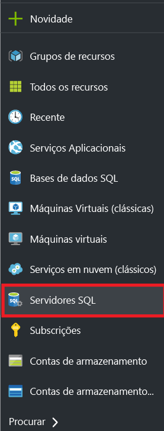
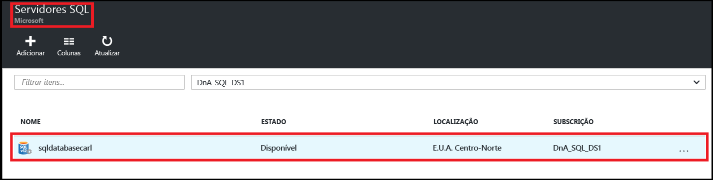
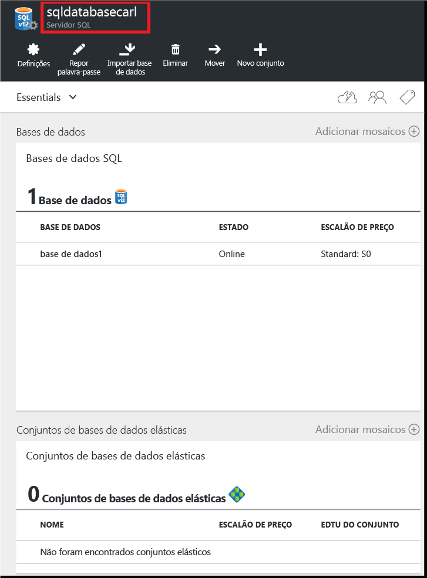
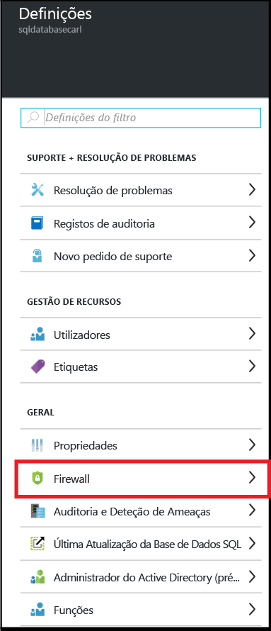
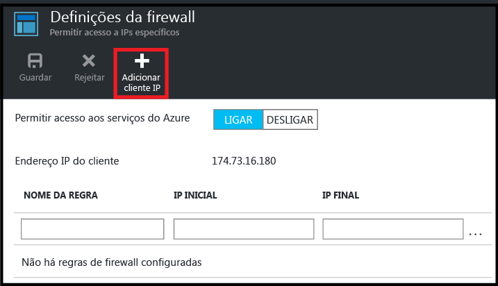
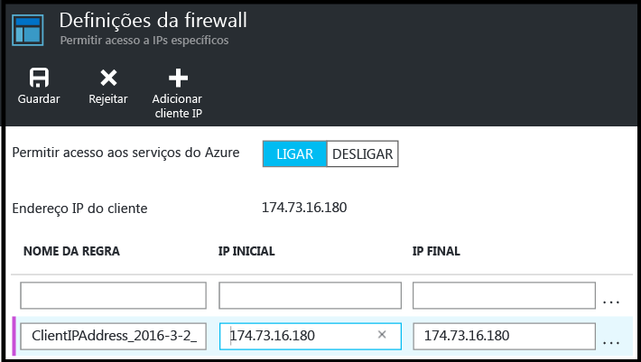
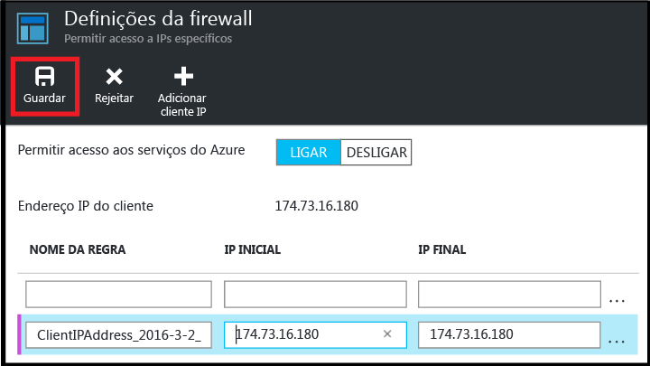

<!--
includes/sql-database-create-new-server-firewall-portal.md

Latest Freshness check:  2016-08-01 , rickbyh.

As of circa 2016-04-11, the following topics might include this include:
articles/sql-database/sql-database-get-started-tutorial.md
articles/sql-database/sql-database-configure-firewall-settings

-->
## Criar uma nova firewall ao nível do servidor do Azure SQL

Utilize os seguintes passos no portal do Azure para criar uma regra de firewall ao nível do servidor para permitir ligações a partir de um endereço IP individual (o computador cliente) ou de todo um intervalo de endereços IP a um servidor lógico da Base de Dados SQL.

1. Se não estiver atualmente ligado, ligue-se ao [Portal do Azure](http://portal.azure.com).
2. No painel predefinido, clique em **SQL servers**.

    

3. No painel **SQL servers**, clique no servidor em que pretende criar a regra de firewall.

    

4. Reveja as propriedades do servidor.

    

5. No painel **Definições**, clique em **Firewall**.

    

    > [AZURE.NOTE] Pode ainda aceder ao painel **Definições da firewall** ao nível do servidor a partir da barra de ferramentas do painel **Base de dados**.

6. Clique em **Adicionar IP do cliente** para que o Azure crie uma regra para o endereço IP do cliente.

      

7. Opcionalmente, para adicionar acesso a um intervalo de endereços IP, clique no endereço IP que foi adicionado ao editar o endereço de firewall.

      

8. Clique em **Guardar** para criar a regra de firewall ao nível do servidor.

     

    >[AZURE.IMPORTANT] O endereço IP do cliente poderá ser alterado de tempos a tempos e poderá não conseguir aceder ao servidor até criar uma nova regra de firewall. Pode verificar o seu endereço IP utilizando o [Bing](http://www.bing.com/search?q=my%20ip%20address). Em seguida, adicione um único endereço IP ou um intervalo de endereços IP. Veja [Gerir as definições da firewall](sql-database-configure-firewall-settings.md#manage-existing-server-level-firewall-rules-through-the-azure-portal) para obter detalhes.

<!--HONumber=sep14_HO2-->

